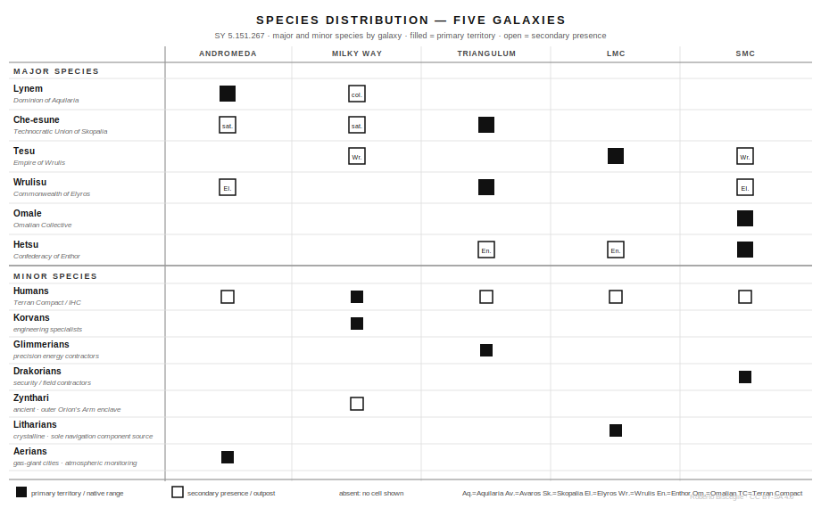

## The Local Group

Five galaxies. Three million light-years of contested space. Dashed lines are WAN corridors — bidirectional artificial wormholes. Dots mark the node stations at each end. Access can be denied.


---

## Andromeda

Four powers. Aquilaria controls the core and the approaches to every surviving Celestial Dominion structure. The other three work around that fact.


---

## Milky Way

The highest density of habitable planets in the Local Group. No single power controls a majority. The Terran Compact is the smallest major player by galactic scale.


---

## Triangulum

Two powers fighting over ruins neither can read, a third that controls the only reliable access to both. Gravitite deposits give Skopalia infrastructure leverage it would lose if anyone decoded the Xalith technology.


---

## Large Magellanic Cloud

Empire of Wrulis in the core, Hetsu clans in the border regions — a situation centuries old that no treaty has resolved. The succession crisis makes everything provisional.


---

## Small Magellanic Cloud

Four overlapping territorial claims, no dominant power, a galaxy that periodically destroys its own infrastructure through supernovae. The WAN link to the LMC has been dark for three years.


---

## Orion's Arm — Human Space

The Terran Compact's slice of the Milky Way, SY 5.151.267. Three thousand years of consolidation merged the former human polities into one compact — formally. Earth holds legacy authority; Nova Terra and Chara hold effective power. The Rim Concord marks the outer limit the frontier coalition wants renegotiated.


---

## WAN Network Topology

Four active inter-galaxy corridors. One dark for three years. Each corridor is operated by whichever powers control the nodes at both ends — and any of them can deny access. The destroyed LMC–SMC link has three competing rebuild claims and no construction started.

```{mermaid}
graph LR
    AND["**Andromeda**<br/>Aquilaria · Avaros<br/>Skopalia · Elyros"]
    TRI["**Triangulum**<br/>Skopalia · Elyros · Enthor"]
    MW["**Milky Way**<br/>Avaros · Terran Compact<br/>Wrulis outposts"]
    LMC["**Large Magellanic Cloud**<br/>Wrulis · Enthor"]
    SMC["**Small Magellanic Cloud**<br/>Enthor · Omalian<br/>Elyros · Wrulis"]

    AND -- "Aquilaria / Avaros" --- MW
    AND -- "Aquilaria / Skopalia / Elyros" --- TRI
    TRI -- "Skopalia / Avaros" --- MW
    MW -- "Avaros / Wrulis" --- LMC
    LMC -. "destroyed · SY 5.151.264<br/>3 yrs dark · rebuild blocked<br/>by competing claims" .- SMC
```

---

## Faction Relationships

Six major polities, three minor ones, and the relationships that define who can go where and at what cost. Solid lines are treaties or cooperation. Dashed lines are active disputes or rivalries. Arrows show direction of constraint or dependency.

```{mermaid}
graph TD
    AQ["**Dominion of Aquilaria**<br/>Lynem · Andromeda"]
    AV["**United Federation of Avaros**<br/>Multispecies · Milky Way"]
    SK["**Technocratic Union of Skopalia**<br/>Che-esune · Triangulum"]
    EL["**Commonwealth of Elyros**<br/>Wrulisu · Triangulum / SMC"]
    WR["**Empire of Wrulis**<br/>Tesu · LMC"]
    EN["**Confederacy of Enthor**<br/>Hetsu · SMC / LMC"]
    TC["**Terran Compact**<br/>Human · Milky Way"]
    OM["**Omalian Collective**<br/>Omale · SMC"]
    ZY["**Zynthari**<br/>ancient · Milky Way outer rim"]

    AQ -. "adversarial equilibrium<br/>(centuries)" .- AV
    AQ -. "rivals: ruins access<br/>40-yr blockade" .- SK
    AQ -. "blocks colony recognition" .- EL
    SK -- "nominally cooperative<br/>(fracturing)" --- EL
    EL -- "quiet alignment<br/>(non-aligned bloc)" --- OM
    EL -- "overlapping territory" --- EN
    AV -. "containment pressure" .- WR
    WR -. "border dispute · 40 yr" .- EN
    AV -->|"diplomatic relay"| ZY
    ZY -- "Rim Concord<br/>(constrains Compact)" --- TC
```

---

## Species Distribution

Which species are present in which galaxies. Filled = primary territory or native range. Open = secondary presence or outpost. Six major species govern galactic politics; seven minor species occupy specialist roles across Charted Space.


