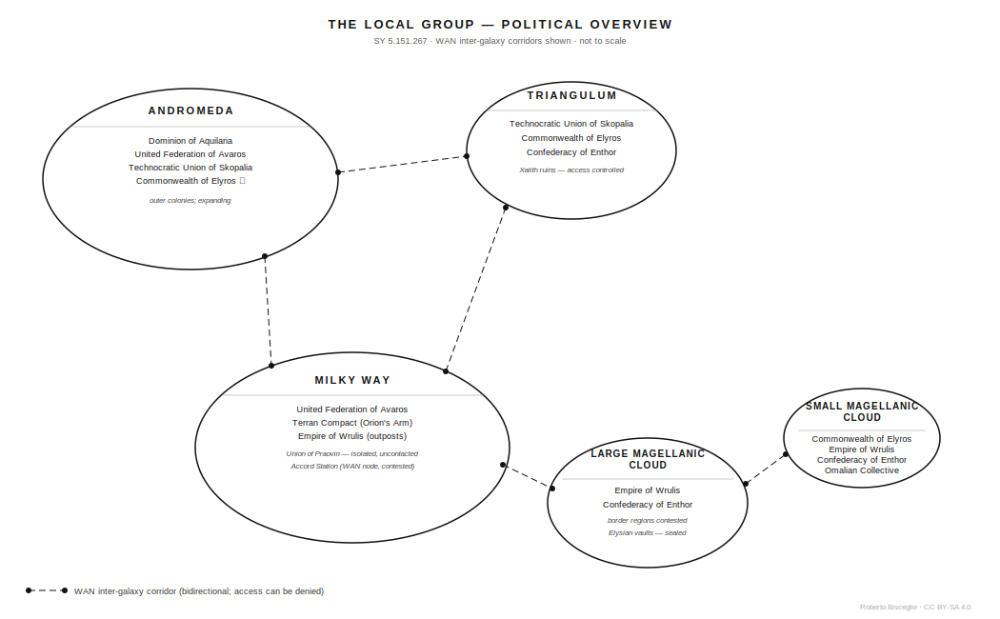
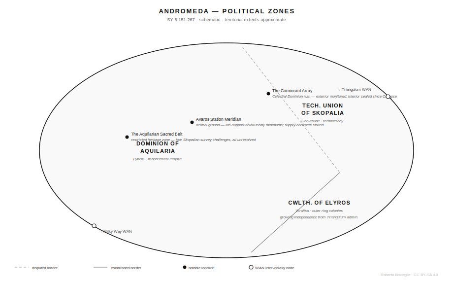
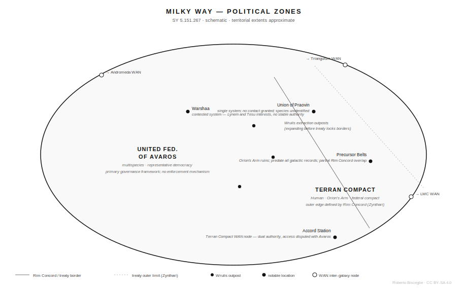
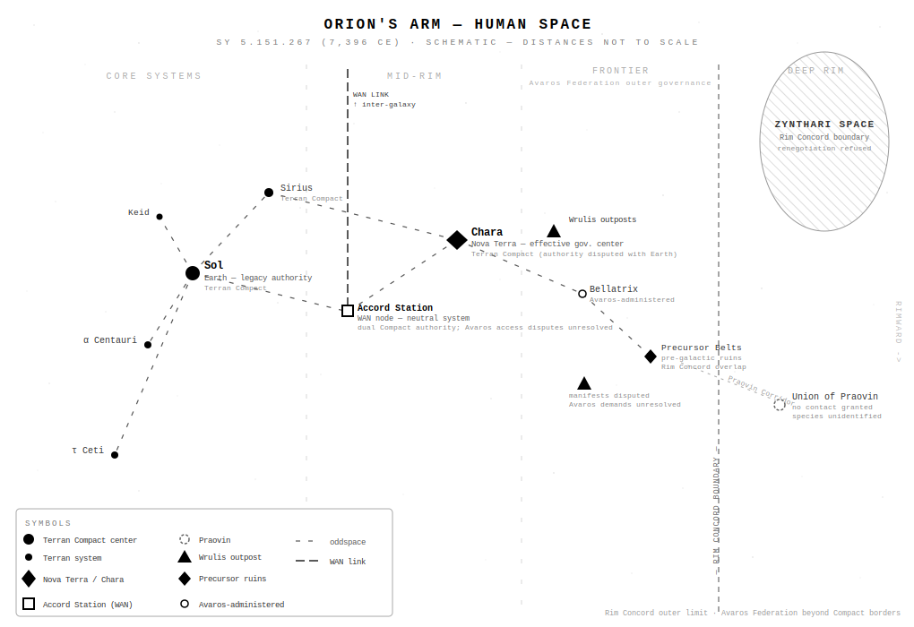
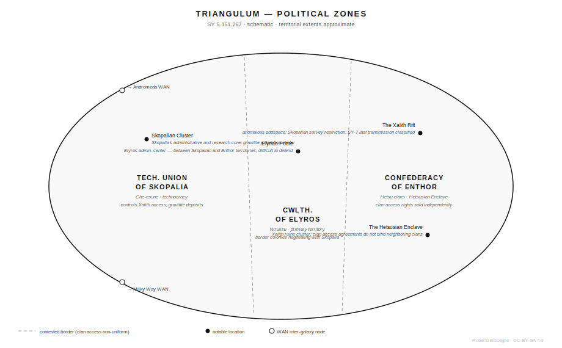
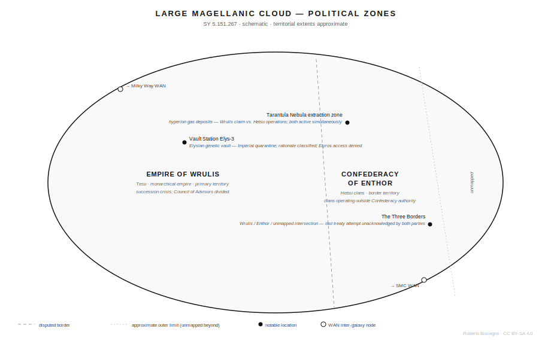
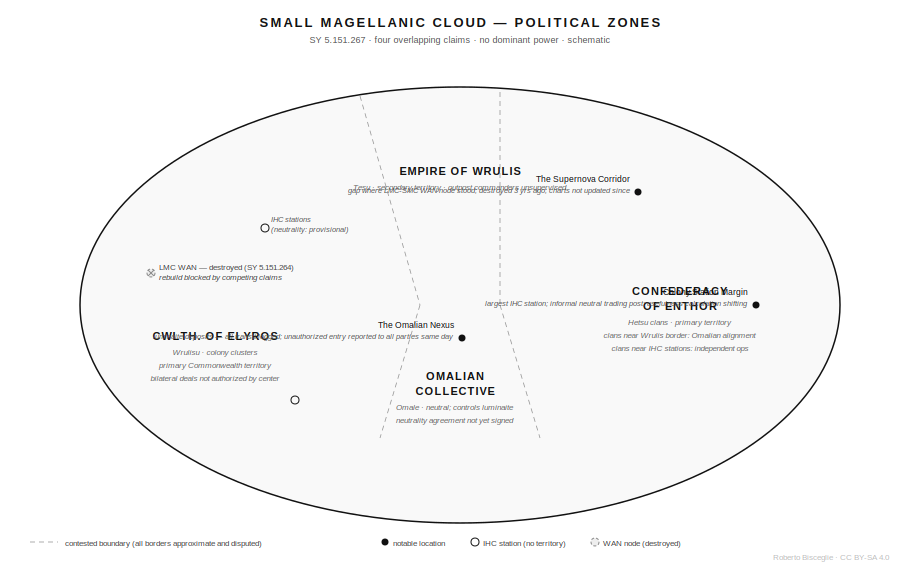
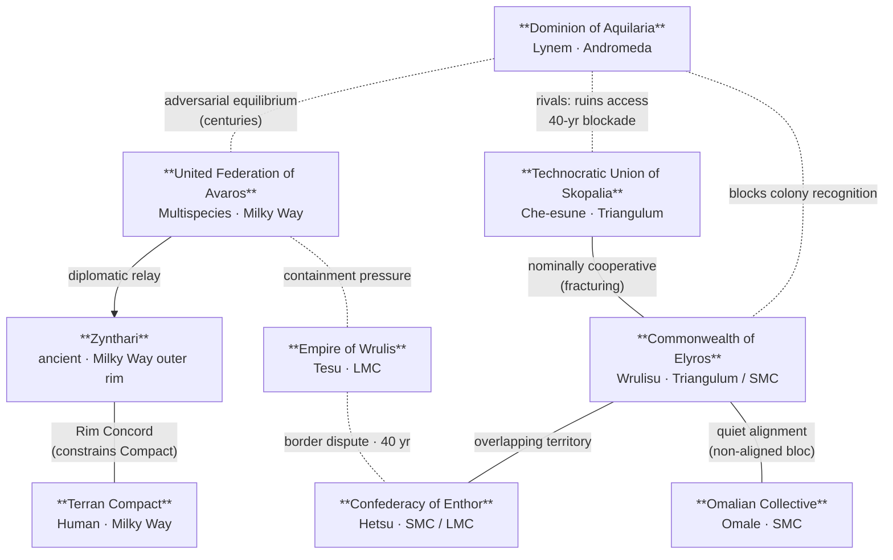

# The Five Galaxies
Roberto Bisceglie
2026-06-03

## Introduction

This document describes a universe, not how to live in it.

In the Sidereal Year 5.151.267 — equivalent to 7,396 CE by the human
calendar — six major species inhabit the Local Group of galaxies: the
Lynem, Che-esune, Tesu, Wrulisu, Omale, and Hetsu. Humans exist here
too, scattered and adaptable, but not dominant. The Terran Compact
governs a fraction of Orion’s Arm in the Milky Way. Outside that margin,
human colonies are independent stations, struggling outposts, or
communities absorbed into larger polities.

The Five Galaxies — Andromeda, the Milky Way, Triangulum, the Large
Magellanic Cloud, the Small Magellanic Cloud — are connected by the
Wormhole Access Network: bidirectional artificial wormholes whose access
points are military, commercial, and industrial stations. Access to
those stations can be denied — they are choke points, and the powers
that hold them set the terms. Ships also traverse oddspace — a medium
that enables faster-than-light travel but consumes fuel and tolerates no
margin for error. A vessel that misjudges its route ends its journey
somewhere it cannot refuel, and no rescue is coming.

Core worlds of major empires manufacture and deploy capabilities that
frontier stations cannot maintain or replace. Exporting advanced
technology is profitable; it is also a political act that disrupts the
economies it enters and destabilizes the polities that receive it. The
largest empires are cosmopolitan by necessity — too many species under
one administration to enforce homogeneity — while smaller nations treat
outsiders with suspicion that hardens to hostility at their borders.

Extinct civilizations left ruins in four galaxies. Their technologies
remain functional. Their original purposes are unknown. Governments and
private interests pay for survey data on new systems and recovered
artifacts; both parties want exclusive rights to what they find.

Stories range from a succession crisis that could redraw the borders of
two galaxies to a debt that needs clearing on a station nobody maps. The
people in those stories are operators, brokers, surveyors, diplomats,
smugglers, and soldiers — not heroes by default.

The situations this setting generates are already in motion.

## The Charted Space

### What Charted Space Is

Charted Space is not a geographic boundary — it is a set of agreements.
A system is “charted” when it has been surveyed, registered with at
least one recognized polity, and connected to the infrastructure of
regular transit. In practice: someone mapped it, claimed it or logged
it, and a route exists that can be serviced.

That registration carries legal weight. Vessels operating on registered
routes are subject to inspection by the powers that maintain them.
Cargoes are taxable. Disputes have theoretically recognized
jurisdictions. Charted Space is where law exists — unevenly applied,
frequently corrupt, and entirely absent in some registered systems, but
present as a framework that shapes every transaction and border
crossing.

Most settled populations in the Five Galaxies live within Charted Space.
Most of the trade, communication, and political activity that governs
them happens here. The infrastructure is real, the routes are
maintained, and the cost of using them is built into the price of
everything.

### Beyond the Edge

Systems outside Charted Space fall into distinct categories. Travelers
who work in them treat the distinctions as practical, not
administrative.

*Unmapped systems* are unknown or incompletely surveyed. They may
contain resources, habitable planets, or pre-collapse ruins. They may
also contain hazards no chart documents: gravitational anomalies,
hostile biology, equipment from extinct civilizations whose function has
not been determined.

*Dead zones* are regions where no WAN node exists and oddspace
navigation is unreliable or actively dangerous. Some are the result of
natural phenomena; others are destroyed infrastructure. The difference
matters — natural dead zones stay where they are.

*Contested regions* carry overlapping claims and no recognized
jurisdiction. The typical consequence for travelers is that multiple
parties may demand inspection, transit fees, or cooperation, sometimes
simultaneously and with contradictory requirements.

*Quarantine areas* are officially designated exclusion zones. The stated
reasons are usually biological hazard or unstable pre-collapse
technology. The actual reasons are sometimes the same. Some quarantine
designations are decades old; the authorities who issued them no longer
exist, and enforcement has passed to whoever claims the adjacent space.

### The Wormhole Access Network

The WAN is the primary infrastructure of inter-galaxy travel. It
consists of artificial, bidirectional wormholes whose endpoints are
maintained stations — military, commercial, or industrial facilities
operated by one of the major powers or, in the case of contested nodes,
by a coalition whose internal agreements are not always published. The
WAN is not neutral infrastructure: every node is owned, every node has
an operator, and access can be refused.

Natural wormholes exist but are rare, typically unidirectional, and
emerge from gravitational phenomena rather than construction. They
cannot be scheduled, are not maintained, and cannot be relied upon for
regular transit. Some natural wormholes are mapped; some have no
recorded exit point and are noted on charts as navigation hazards.

Artificial wormholes require ongoing maintenance. A node that is not
serviced will degrade and eventually collapse. Several WAN corridors in
contested or underfunded regions are known to be in poor repair.
Transiting through a degraded node is not publicly advertised as
dangerous — but the failure mode, if a node collapses mid-transit, has
no confirmed survivors. The maintenance records for nodes in border
regions are not publicly accessible.

The major powers maintain separate route networks that partially
overlap. Aquilarian routes concentrate in Andromeda with extensions to
Triangulum and the Milky Way. Avaros routes center on the Milky Way and
reach into Triangulum and the Large Magellanic Cloud. Skopalian
infrastructure focuses in Triangulum. The Empire of Wrulis operates
primarily in the Large Magellanic Cloud with Milky Way extensions. The
Commonwealth of Elyros links Triangulum and the Small Magellanic Cloud,
with a growing Andromeda presence. The Confederacy of Enthor maintains
minimal routes in the Small Magellanic Cloud, prioritizing resource
exchange over connectivity. The points where these networks intersect
are among the most contested locations in the Five Galaxies — every such
junction is a chokepoint that someone controls and someone else wants.

#### WAN Network Topology

Four active inter-galaxy corridors. One dark for three years. Each
corridor is operated by whichever powers control the nodes at both ends
— and any of them can deny access. The destroyed LMC–SMC link has three
competing rebuild claims and no construction started.

### Oddspace

Oddspace is the FTL medium ships traverse when not transiting through
WAN wormholes. It is not a shortcut — it is a separate dimension of
space entered and exited by drives that consume fuel. Within oddspace,
conventional distances do not apply, but traversal still takes time,
requires navigation, and requires fuel for the return to normal space.

The constraints are practical: fuel tanks have finite capacity, and
oddspace offers no resupply. Route planning means identifying a chain of
waypoints — ideally systems with functional fuel infrastructure — and
not extending beyond what the ship’s tanks support. A ship that runs out
of fuel in oddspace cannot call for help. Communications from within
oddspace do not transmit to normal space.

Ships that enter oddspace without adequate charting data, or that
encounter navigational anomalies mid-transit, may exit in unintended
locations. “Unintended” can mean an unsurveyed system with no
infrastructure. It can also mean a location that no chart records at
all. Some of these have been found after the fact, by ships following
distress beacons whose signal arrived months late. Some have not been
found.

Oddspace and WAN travel are distinct and complementary. WAN corridors
offer faster, more reliable transit between nodes but require access to
maintained infrastructure and the approval of the operating power.
Oddspace travel is slower and more demanding but does not require
permission. The practical consequence is that WAN-controlling polities
can deny transit rights to specific vessels — and those vessels can use
oddspace to bypass the WAN, at higher fuel cost and navigational risk.
This asymmetry is why embargoes are never fully enforceable and why some
operators prefer not to appear in WAN transit logs at all.

### Travel as a Pressure System

Movement within Charted Space is not free. Every standard route has a
maintaining power that charges transit fees, conducts inspections, and
reserves the right to refuse passage. Permits for certain cargo
categories — advanced technology, weapons, biological materials,
pre-collapse artifacts — may require approval from multiple
jurisdictions when a route crosses polity borders, and the approvals do
not always arrive before departure windows close.

Security on established routes is not uniform. Corridors between major
core systems are patrolled; piracy on them carries a measurable response
risk. Routes at the edges of polity territory, through contested
regions, or through underfunded corridors receive less attention. Escort
services exist for freight that cannot risk unprotected transit; their
cost is high enough that operators who decline are making a deliberate
calculation.

Embargoes and political closures occur without advance notice. A trade
dispute between two powers can result in a WAN node being declared
closed to vessels registered with the opposing power within hours of a
diplomatic breakdown. Vessels caught mid-route face diversion,
inspection, or impoundment depending on which node they reach first.
There is no general early-warning system for closures; the closest
equivalent is a network of brokers and station operators who sell
transit intelligence as a service.

The most consistent feature of travel in the Five Galaxies is that the
cost, risk, and availability of transit are set by whoever controls the
infrastructure between origin and destination — and that control is
always conditional, always contested, and always worth money to the
right buyer.

------------------------------------------------------------------------

### Chronological Reference

The dates below are anchor points in the Sidereal Year (SY) calendar, a
common standard used by convention across most of Charted Space. Earlier
records are fragmentary, internally inconsistent, or held exclusively by
specific powers who have not published them. The events listed here
represent what is broadly known — or broadly believed — not what is
fully documented.

Current date: **SY 5.151.267** (= 7,396 CE by the human solar calendar).

------------------------------------------------------------------------

- **SY undatable** — Collapse of the Precursor civilization (Milky Way,
  Orion’s Arm). Physical dating places the youngest confirmed sites at
  approximately 48,000–50,000 SY before current; the oldest documented
  site exceeds 10 million SY before current. Ruins are distributed
  across a limited number of Orion’s Arm systems. Partially translated
  Precursor records describe the collapse as a rimward catastrophe; the
  nature and origin of that catastrophe have not been confirmed. Several
  of the most intact sites fall within Rim Concord restricted zones
  whose rationale the Zynthari have not disclosed.

- **SY ~5.101.000** — Collapse of the Celestial Dominion (Andromeda
  Galaxy). The last of their orbital megastructures was abandoned within
  a few centuries of this date. The collapse mechanism is unknown; Lynem
  historical records, the oldest surviving sources, disagree on the date
  by approximately 20,000 SY.

- **SY ~5.116.000** — Cessation of the Xalith Empire (Triangulum
  Galaxy). The last confirmed Xalith-built structure continues to
  transmit on a frequency no current species has decoded. What ended the
  Xalith is not recorded in any source accessible to researchers.

- **SY ~5.128.000** — The Elysian Empire ceases all external contact
  (Large Magellanic Cloud). No military defeat is recorded; available
  evidence suggests a voluntary withdrawal followed by silence. Their
  genetic vaults were sealed from the inside.

- **SY ~5.135.000** — Foundation of the Dominion of Aquilaria
  (Andromeda). The oldest reliably dated polity in the Five Galaxies by
  external record. Lynem dynastic histories extend the lineage
  significantly further back; those extensions are not independently
  verified.

- **SY ~5.143.000** — Foundation of the Empire of Wrulis (Large
  Magellanic Cloud). Imperial records trace the current dynasty to this
  date. Infrastructure dating conducted by external researchers places
  the actual consolidation of territorial control approximately 600 SY
  later; the Empire contests this finding.

- **SY ~5.148.000** — First reliable documentation of natural wormhole
  transit (Triangulum–Milky Way corridor). Multiple species claim
  independent prior discovery. The credit dispute has not been resolved
  and resurfaces in treaty negotiations at irregular intervals.

- **SY 5.150.033** — First artificial wormhole constructed and
  stabilized. The Technocratic Union of Skopalia claims full priority.
  The United Federation of Avaros holds documents indicating a
  collaborative research program whose Skopalian partners dissolved the
  partnership and retained the technology unilaterally. Neither party
  has agreed to arbitration.

- **SY 5.150.412** — First inter-galaxy WAN corridor established
  (Triangulum to Milky Way). The original operating protocols granted
  equal access to all registered vessels; those protocols were amended
  eleven times in the first century of operation.

- **SY 5.150.619** — United Federation of Avaros formally chartered.
  Founded to provide Milky Way governance that did not require species
  dominance. The specific conflict the founding was intended to resolve
  is not named in the founding documents.

- **SY 5.150.891** — Confederacy of Enthor ratified (Small Magellanic
  Cloud). The treaty followed Hetsu-Tesu skirmishes over resource
  systems in the Large Magellanic Cloud border regions. Neither the
  Empire of Wrulis nor the Confederacy describes the outcome of those
  skirmishes in compatible terms.

- **SY 5.151.104** — Last confirmed transmission from Survey Expedition
  SY-7 (Xalith Rift, Triangulum). The Technocratic Union of Skopalia
  classified the expedition’s prior transmissions. No search expedition
  has been authorized. The Rift access coordinates used by SY-7 are not
  publicly available.

- **SY 5.151.267** — Current date.

## The Five Galaxies

The Local Group spans approximately three million light-years. Five
galaxies within it are connected by the Wormhole Access Network and
support interstellar civilizations. Each is politically and
environmentally distinct. Each is described here at the level of powers,
pressures, and available stories — not as a comprehensive survey. The
tensions listed are active. The locations named are notable examples,
not complete records.

------------------------------------------------------------------------

### Andromeda

Andromeda is where old empires manage ancient rivalries while arguing
over ruins that neither of them can open.

**Political climate.** Four major powers have occupied Andromeda long
enough that their territorial boundaries look permanent on maps and
function as flashpoints in practice. The Dominion of Aquilaria and the
United Federation of Avaros have maintained an adversarial equilibrium
for centuries — Aquilaria expanding through military pressure, Avaros
resisting through diplomatic frameworks that Aquilaria ignores when
convenient. The Technocratic Union of Skopalia and the Commonwealth of
Elyros share a nominally cooperative relationship that fractures
whenever a pre-collapse Celestial Dominion site becomes accessible.
Aquilaria controls the approaches to the most intact Celestial Dominion
megastructures and has used that control to block Skopalian survey
requests for the past forty years without formally rejecting them.

**Major powers.**

- **Dominion of Aquilaria** \| Lynem \| Monarchical empire, hereditary
  rule, council of noble houses, feudal regional governors \| *Core
  objective:* expand territorial control and preserve Lynem cultural
  primacy in Andromeda \| *Internal fault line:* noble houses compete
  with military commanders for policy influence; the current monarch’s
  health is not publicly disclosed \| *Right now:* securing physical
  access to Celestial Dominion megastructure sites before Skopalian
  survey teams can document their contents

- **United Federation of Avaros** \| Multispecies \| Representative
  democracy, rotating species leadership, Council of Representatives \|
  *Core objective:* sustain a multispecies governance framework that
  prevents any one species from holding permanent dominance \| *Internal
  fault line:* rotating leadership creates policy reversals every
  generation; the current Avaros council has been deadlocked over
  Aquilaria relations for six years \| *Right now:* a negotiated
  settlement with Aquilaria that does not require military expenditure
  Avaros cannot sustain

- **Technocratic Union of Skopalia** \| Che-esune \| Technocratic
  republic, leadership by demonstrated scientific expertise, Bureau of
  Resource Allocation \| *Core objective:* maintain technological
  advantage through control of pre-collapse research and strategic
  mineral access \| *Internal fault line:* an entrenched senior research
  tier blocks outside access and younger Skopalian scientists are
  leaving for Avaros institutions \| *Right now:* exclusive survey
  rights to Celestial Dominion ruins in the Andromeda outer belt before
  Aquilaria’s blockade becomes permanent policy

- **Commonwealth of Elyros** \| Wrulisu \| Cooperative colony
  governance, individual colony autonomy with central representation \|
  *Core objective:* preserve colony autonomy and inter-colony resource
  sharing \| *Internal fault line:* Andromeda colonies have been
  operating with increasing independence from the Triangulum-based
  central administration; several have begun bilateral negotiations with
  Aquilaria \| *Right now:* territorial recognition from Aquilaria for
  the Andromeda outer colonies, which Aquilaria has declined to
  formalize

**Economic pressure.** The asteroid belts adjacent to Celestial Dominion
megastructure sites contain rare minerals essential for advanced
manufacturing. Access to those belts is controlled by Aquilarian transit
permits that can be revoked without cause. Medicinal biotech compounds
from Andromeda’s surviving ecospheres are commercially valuable;
Aquilaria controls most of the surveyed extraction sites and sets export
prices unilaterally. Skopalia’s graviton crystal deposits in Andromeda
give it leverage it would lose if Aquilaria’s territorial consolidation
continues.

**Typical conflicts.** Aquilarian border patrols intercepting Skopalian
survey ships near ruins sites and confiscating equipment under
“preservation protocols” that have no treaty basis. Avaros diplomatic
missions stalled for months by Aquilarian administrative review
procedures that do not formally exist. Elyros colony supply convoys
rerouted through Aquilarian checkpoints where inspection fees are not
standardized. A secondary market in Celestial Dominion artifacts
operates through Avaros-registered intermediaries; the artifacts’
provenance is uniformly undocumented.

**Story register.** Andromeda supports stories from the macro-political
— a breakdown in the Aquilaria-Avaros equilibrium that would redraw
access to every WAN node in the galaxy — down to the operational: a
survey team with permits for one Celestial Dominion site and evidence
that something far more valuable is in the adjacent restricted zone. The
Elyros colonial drift is a slow-motion succession of small decisions
that could end in a permanent split or an Aquilarian annexation, and
neither outcome is certain yet.

The Aquilarian Royal Navy has placed an exclusion perimeter around a
Celestial Dominion megastructure in the outer belt — officially for
“structural preservation.” Skopalia wants access to document it. Avaros
wants to broker access rights. A salvage crew that entered three months
ago has not returned, and their last transmission was jammed before
anyone could confirm its contents.

An Elyros colony in Andromeda’s outer ring has ceased reporting to the
Commonwealth administration and has been negotiating a bilateral trade
agreement with Aquilaria. The Commonwealth wants to know why.
Aquilaria’s response to any inquiry is that the colony’s business is its
own.

**Notable locations.** This list is not a survey of Andromeda — it
identifies three locations relevant to current tensions.

- **The Cormorant Array** — a Celestial Dominion orbital megastructure
  in the Aquilaria-Skopalia border region, partially functional, with
  internal sections that have not been accessed since the Dominion’s
  collapse. Both powers have installed monitoring equipment on the
  exterior. Neither has successfully entered.
- **Avaros Station Meridian** — the Federation’s primary diplomatic
  facility in Andromeda, designated neutral ground by treaty. Aquilaria
  has been delaying its maintenance supply contracts for three years.
  The station’s life-support redundancy is now below treaty-mandated
  minimums.
- **The Aquilarian Sacred Belt** — an asteroid field formally designated
  a Lynem cultural heritage site. External surveys and transit are
  prohibited. Skopalia maintains the designation was issued specifically
  to prevent mineral surveying and has filed four treaty challenges, all
  unresolved.

------------------------------------------------------------------------

### Milky Way

The Milky Way is where the Lynem and Tesu have been contesting dominance
for longer than most polities have kept records, and where a third party
controls a system no one has successfully described.

**Political climate.** No single power controls a majority of the Milky
Way. The United Federation of Avaros functions as the primary governance
framework for the multispecies population, but its authority depends on
continued trade and has no enforcement mechanism against a determined
unilateral actor. Lynem colonial interests extend from Andromeda; Tesu
interests extend from the Large Magellanic Cloud. Neither can commit
fully here while managing obligations elsewhere. The Terran Compact
holds Orion’s Arm territory built through centuries of independent
expansion and operates its own FTL infrastructure; its outer edge is
defined by the Rim Concord with the Zynthari — a constraint the Compact
did not choose and has not been able to revise. The Union of Praovin
controls a single system and has declined every formal diplomatic
contact from any registered power.

**Major powers.**

- **United Federation of Avaros** \| Multispecies \| Representative
  democracy \| *Core objective:* maintain the Milky Way as a
  non-dominance multispecies space \| *Internal fault line:* member
  species disagree on trade priority; the current Council has been
  unable to ratify a new transit-fee structure for four years \| *Right
  now:* a treaty revision with both Aquilaria and the Empire of Wrulis
  that prevents either from using Milky Way territorial gaps to expand
  unchecked

- **Terran Compact** \| Human \| Federal compact; de facto
  administration at Nova Terra (Chara system), formal institutional
  authority at Earth, the discrepancy unresolved \| *Core objective:*
  maintain Orion’s Arm territorial integrity and manage the Rim Concord
  constraints that define the Compact’s outer edge \| *Internal fault
  line:* Nova Terra’s governing bloc and Earth’s legacy institutions
  hold incompatible claims to Compact authority; the ambiguity is the
  working arrangement, not a gap either side is trying to close, because
  resolution would require one to formally subordinate the other \|
  *Right now:* a frontier coalition demanding Rim Concord renegotiation
  with the Zynthari, which the Nova Terra administration refuses to
  table — any revision requires Zynthari engagement and the Zynthari
  have given no signal they are willing to open the Concord

- **Empire of Wrulis (Milky Way outposts)** \| Tesu \| Imperial
  authority extended from LMC primary territory \| *Core objective:*
  resource extraction and strategic positioning in advance of treaty
  negotiations \| *Internal fault line:* outpost commanders operate with
  limited oversight from LMC imperial authority, making their decisions
  difficult to formally disavow \| *Right now:* expanding extraction
  operations in Avaros-adjacent systems before a new treaty locks
  current borders

- **Union of Praovin** \| Unknown \| Unknown \| The Praovin system is
  charted; the Union is registered in WAN records as a recognized
  polity. No diplomatic mission to the system has been granted entry. No
  census, survey, or biological record is publicly available. The
  species inhabiting the system has not been formally identified.
  Transit through the Praovin Corridor is intermittently blocked without
  notice or explanation.

**Economic pressure.** The Milky Way contains the highest density of
habitable planets of any galaxy in the Local Group, which drives
colonization competition that no treaty has resolved. Duranium and
stellium alloy deposits in contested border systems are extracted by
whichever party is currently able to operate there; the legal status of
that extraction is contested in every case. Pre-collapse ruins scattered
across the galaxy contain technological fragments that Skopalian and
Wrulis survey teams both want; Avaros policy requires survey data
sharing, which both parties circumvent routinely.

**Typical conflicts.** Species customs disputes at Avaros trade hubs,
where what counts as a controlled substance varies by species and by who
is conducting the inspection. Wrulis extraction teams filing paperwork
with Avaros-registered WAN nodes while operating in systems their
permits do not cover. Human colony stations used as informal resupply
points by both Lynem-aligned and Tesu-aligned vessels, sometimes
simultaneously, without the colonies being consulted. The Praovin
Corridor blocked again, no explanation given, and a cargo convoy that
was three days out now needs a reroute that adds six weeks.

**Story register.** The Milky Way’s scale means that any story from
species-level negotiation to a single cargo dispute can coexist here.
Human characters are local players navigating between forces that are
not particularly interested in them. The Praovin situation is a gap in
the record that is either dangerous or profitable depending on what
fills it.

The Union of Praovin has submitted a request for licensed surveyors
through an Avaros diplomatic channel. The request does not state the
survey target, the compensation terms, or what credentials are required.
Avaros forwarded it without comment. Three parties have responded, and
none of them are survey firms.

A Wrulis extraction outpost in a nominally Avaros-registered system has
been operating for four years. The Federation’s repeated withdrawal
demands have produced no response. The outpost’s cargo manifests — filed
with a WAN node it uses — show materials that do not match anything that
system was surveyed to contain. The manifests are public record. No one
has acted on them.

**Notable locations.** This list is not a survey of the Milky Way.

- **Warshaa** — a multi-planet system with no stable governing
  authority; Lynem colonial interests and Tesu commercial operations
  have each held administrative control here at different times, and the
  current situation is that both are present and neither is officially
  recognized.
- **Accord Station** — the Terran Compact’s sole WAN interface, placed
  in a neutral Orion’s Arm system through four years of political
  dispute between Earth’s legacy institutions and Nova Terra’s governing
  bloc; neither party got the location it wanted, and both administer
  the station under incompatible authority. Access disputes with Avaros
  persist because two Compact bodies apply contradictory standards to
  non-human traffic through the same node.
- **The Praovin Corridor** — the only charted approach to the Union of
  Praovin’s home system; traffic is intermittently closed without
  notice, and no vessel that has passed through under Union
  authorization has subsequently reported on what it found.
- **The Precursor Belts** — Orion’s Arm systems containing ruins of a
  local extinct civilization distinct from the Celestial Dominion,
  Xalith, and Elysian; the oldest sites predate reliable galactic
  records by a margin instrumentation cannot resolve. Partial
  translation of Precursor records is ongoing in Terran Compact research
  institutions. Several of the most intact sites fall within Rim Concord
  restricted zones, which the Zynthari have designated under ancient
  claims without specifying their nature.

------------------------------------------------------------------------

### Triangulum

Triangulum is where two powers have been fighting over ruins they cannot
read for two centuries, while a third controls the only reliable access
to both.

**Political climate.** The Technocratic Union of Skopalia holds
technological dominance in Triangulum but is materially dependent on
mineral deposits it does not fully control. The Commonwealth of Elyros
has territory and route infrastructure but lacks the military capacity
to enforce its claims when Skopalia decides not to cooperate. The
Confederacy of Enthor’s Hetsusian Enclave sits on the most accessible
Xalith ruins — neither Skopalia nor Elyros can reach them without Hetsu
cooperation, and Hetsu cooperation is clan-specific, inconsistent, and
increasingly operating outside Confederacy authority.

**Major powers.**

- **Technocratic Union of Skopalia** \| Che-esune \| Technocratic
  republic, merit-based governance \| *Core objective:* maintain
  technological monopoly through controlling pre-collapse research
  access \| *Internal fault line:* a senior research tier has entrenched
  itself in resource allocation; researchers with independent
  discoveries are leaving for outside institutions rather than filing
  through Union channels \| *Right now:* securing and classifying all
  access routes to the Xalith Rift before the SY-7 expedition’s
  classified data becomes reconstructable by outside parties

- **Commonwealth of Elyros** \| Wrulisu \| Cooperative colony governance
  \| *Core objective:* preserve colony autonomy and inter-colony
  resource sharing; Triangulum is the primary Commonwealth territory \|
  *Internal fault line:* colony councils near the Skopalian Cluster
  border have begun negotiating resource access agreements with Skopalia
  directly, bypassing the Commonwealth’s collective decision framework
  \| *Right now:* formal Skopalian recognition of Elyros territorial
  claims in the border region near the Skopalian Cluster

- **Confederacy of Enthor** \| Hetsu clans \| Loose clan confederacy,
  clan autonomy with periodic representative gatherings \| *Core
  objective:* mutual defense and preservation of clan territories \|
  *Internal fault line:* clans adjacent to Xalith ruins have been
  selling access to outside survey teams without Confederacy
  authorization; the revenue has made those clans unwilling to stop \|
  *Right now:* formal territorial recognition from Skopalia in exchange
  for managed Xalith access — a deal the Confederacy’s central body
  wants but individual clans may already be offering independently

**Economic pressure.** Gravitite and plasmonic crystals, found primarily
in Triangulum, are essential for certain WAN node maintenance processes.
Skopalia controls the primary deposits, which gives it infrastructure
leverage disproportionate to its military capacity. The Xalith ruins
represent technology that could theoretically break that leverage —
which is precisely why Skopalia controls access so tightly, and why
everyone else wants through.

**Typical conflicts.** Unauthorized survey teams attempting to reach the
Xalith Rift, intercepted by either Skopalian patrols or individual Hetsu
clan guards depending on the approach route taken. Elyros supply ships
rerouted through Skopalian checkpoints for “administrative review” that
takes weeks. A secondary market in Xalith artifacts operates through
Hetsu intermediaries in the Hetsusian Enclave fringe stations;
Skopalia’s suppression of this market is persistent and only partially
effective. Elyros colony councils approving Skopalian access agreements
that the Commonwealth central administration then contests.

**Story register.** Triangulum’s stories are about access and knowledge
— who gets to know what, who gets to sell what they’ve found, and who
gets to decide what the Xalith left behind means. Skopalia’s meritocracy
means that credentials, not money, can sometimes open doors here, which
creates a specific kind of leverage for operators who can demonstrate
expertise. The slow fracture of Confederacy authority in the Hetsusian
Enclave is a story that has not reached its crisis point yet.

Survey Expedition SY-7’s last transmission was classified by the
Technocratic Union within hours of receipt. Three parties are now
separately reconstructing what the expedition found — Skopalia to
suppress it, an Avaros academic institution to publish it, and an
unidentified agent whose affiliation has not been confirmed. All three
are using different methods and do not know about each other.

An Elyros colony near the Skopalian Cluster border has been receiving
regular supply shipments from a source that does not appear in any WAN
transit record. The colony council denies knowledge of the supplier. The
supplies include equipment used in pre-collapse technology analysis.

**Notable locations.** This list is not a survey of Triangulum.

- **The Xalith Rift** — a region of anomalous oddspace behavior
  surrounding the densest cluster of Xalith ruins; officially under
  Technocratic Union survey restriction, with access coordinates
  classified after the SY-7 incident; several unauthorized approach
  attempts have been made and none confirmed as successful.
- **Elyrian Prime** — the Commonwealth of Elyros’s administrative center
  in Triangulum, physically located between Skopalian and Enthor
  territories; its strategic position makes it simultaneously the
  Commonwealth’s most important facility and the one it has the most
  difficulty defending.
- **The Hetsusian Enclave** — Confederacy of Enthor territory
  surrounding a cluster of Xalith-era ruins; individual Hetsu clans
  control access to different sectors, and a passage agreement with one
  clan is not honored by another; the Confederacy’s central authority
  has not been able to enforce uniformity and has stopped trying
  publicly.

------------------------------------------------------------------------

### Large Magellanic Cloud

The Large Magellanic Cloud belongs to the Empire of Wrulis in the core
systems and to no one reliably in the border regions, where Hetsu clans
and Tesu extraction crews have been contesting the same territory for
centuries.

**Political climate.** The Empire of Wrulis controls most of the LMC but
has never incorporated the Hetsu-held border regions. The Confederacy of
Enthor maintains secondary territory here alongside the Small Magellanic
Cloud, and Hetsu border clans have proven more durable than any Imperial
pacification campaign has managed. The current Emperor has no confirmed
heir; the Council of Advisors is factionally divided; and a succession
question that should be internal is becoming a regional destabilizer as
outside parties begin positioning for post-transition access agreements.
The Commonwealth of Elyros has been attempting to reach the Elysian
genetic vaults in the LMC for decades and the Empire has not formally
explained why it will not grant access.

**Major powers.**

- **Empire of Wrulis** \| Tesu \| Monarchical empire, hereditary
  Emperor, Council of Advisors, Royal Guard \| *Core objective:*
  territorial expansion and control of strategic resource extraction \|
  *Internal fault line:* the succession question; the Council’s
  factional divisions have already produced two contradictory policy
  positions on Confederacy relations in the past year \| *Right now:*
  securing the Tarantula Nebula extraction zone before Hetsu clan
  operations establish facts on the ground that are harder to reverse
  than a treaty gap

- **Confederacy of Enthor** \| Hetsu clans \| Loose confederacy, clan
  autonomy \| *Core objective:* preserve clan territory and prevent
  Imperial incorporation \| *Internal fault line:* border clans are
  operating independently of Confederacy central authority, running
  extraction operations and access agreements without coordination; this
  makes the Confederacy difficult to negotiate with because any
  agreement may not bind the relevant party \| *Right now:* formal
  Imperial recognition of three disputed border systems in exchange for
  a ceasefire on extraction disputes — if the Confederacy’s central body
  can actually deliver the relevant clans

**Economic pressure.** Hyperion gas, concentrated in the Tarantula
Nebula region, is a fuel precursor used in WAN node maintenance. The
Empire of Wrulis controls the primary deposits and uses that leverage
across WAN infrastructure negotiations with other powers. The Elysian
genetic vaults, sealed approximately 23,000 SY ago, contain biological
engineering technology from a civilization that was more advanced than
any current species in this field. Both the Empire and the Commonwealth
of Elyros have independent reasons to want access; the Empire has not
explained why it continues to block the Commonwealth’s survey requests.

**Typical conflicts.** Wrulis extraction teams and Hetsu clan patrols
reaching the same resource site simultaneously, with neither authorized
to be there under the other’s territorial framework. Elysian vault sites
approached by multiple parties who have each obtained different and
incompatible access claims from different Imperial administrative
offices. Commonwealth survey ships entering LMC space on permits issued
by one Imperial bureau and intercepted by a different one with no record
of the permits. The factional divide in the Council of Advisors
producing contradictory signals to outside parties about what the Empire
will agree to.

**Story register.** The LMC’s dominant story register is the pressure of
a large power fracturing from the top while its competitors try to
benefit and its border populations try to survive the instability. The
Elysian vaults represent a prize that could shift the biology of
civilization — which is either an opportunity or a reason that someone
sealed them from the inside, depending on what they contain.

The Council of Advisors has quietly contacted three separate outside
parties about the succession question — but asked each party a different
question. One was asked about legal precedent. One was asked about
military alliance options. One was asked about emergency evacuation
logistics. Someone in the Council is building leverage for a specific
outcome. Someone else is being set up.

A Commonwealth of Elyros expedition has been operating in the Tarantula
Nebula border zone for eight months on a survey permit that expired four
months ago. The Empire has not revoked it. The Confederacy has not
expelled them. Neither party has responded to the other’s requests to
address the overstay. The expedition has not filed any reports.

**Notable locations.** This list is not a survey of the Large Magellanic
Cloud.

- **The Tarantula Nebula extraction zone** — a star-forming region with
  hyperion gas deposits claimed by the Empire of Wrulis; the outer
  sections are disputed by Hetsu clans who have been operating
  extraction equipment there longer than the Imperial territorial claim
  has existed; both parties’ equipment is currently running
  simultaneously in adjacent sectors.
- **Vault Station Elys-3** — one of the known Elysian Empire genetic
  vault sites, under Imperial quarantine since the order was issued by
  an Emperor whose specific rationale was classified; multiple parties
  have independent evidence suggesting the quarantine was not issued for
  the stated biological safety reasons.
- **The Three Borders** — a cluster of systems at the intersection of
  Wrulis Imperial territory, Confederacy clan land, and unmapped space;
  no stable jurisdiction has been established here; the most recent
  treaty attempt produced a document that neither party currently
  acknowledges as binding.

------------------------------------------------------------------------

### Small Magellanic Cloud

The Small Magellanic Cloud has four overlapping territorial claims, no
dominant power, a galaxy that periodically destroys its own
infrastructure through supernovae, and the only party with a neutral
position is the one everyone needs for access to the resource they all
want.

**Political climate.** The Empire of Wrulis and the Confederacy of
Enthor both claim substantial territory here while neither can commit
fully — Wrulis is managing its succession crisis and LMC border
situation, Enthor is managing the same border situation from the other
side. The Omalian Collective controls the primary luminaite deposits and
has maintained a cooperative-neutrality stance that depends on neither
Wrulis nor Enthor deciding the deposits are worth a direct
confrontation. The Commonwealth of Elyros maintains Wrulisu colony
clusters here as part of its primary territory, and has been developing
a quiet alignment with the Omalian Collective — two cooperative
societies with no military expansion ambitions, a combination that makes
them complementary partners and jointly exposed if either larger power
decides to test that orientation. Independent Human Colonies occupy
positions of incidental strategic value — transit waypoints, refueling
stations, neutral meeting grounds — which makes them useful to all
parties and safe from none of them.

**Major powers.**

- **Empire of Wrulis** \| Tesu \| Imperial, secondary territory \| *Core
  objective:* establish controlling position in SMC before succession
  crisis constrains the Empire’s capacity for external operations \|
  *Internal fault line:* same succession and Council divisions as in
  LMC; SMC outpost commanders are operating with even less oversight
  than in the Milky Way \| *Right now:* control of the primary luminaite
  deposit zones, currently subject to competing claims from both the
  Confederacy and the Omalian Collective

- **Confederacy of Enthor** \| Hetsu clans \| Loose confederacy, primary
  territory here \| *Core objective:* territorial preservation; the SMC
  is the Confederacy’s core holding \| *Internal fault line:* clans near
  the Wrulis border favor a Omalian alliance; clans near Independent
  Human Colony stations favor independent operations; the central body
  cannot reconcile these positions \| *Right now:* formal exclusion of
  Wrulis military assets from three border systems, and a neutrality
  agreement with the Omalian Collective that the Collective has not yet
  signed

- **Omalian Collective** \| Omale \| Cooperative governance, pack-based
  social structure \| *Core objective:* maintain collective resource
  access and prevent forced alignment with either major power \|
  *Internal fault line:* geographic pack differentiation has produced
  subgroups with incompatible resource priorities; the Collective’s
  consensus process has been deadlocked on luminaite access policy for
  two years \| *Right now:* a neutrality agreement that prohibits Wrulis
  and Enthor from using Omalian space as staging ground — the Collective
  has not signed Enthor’s proposed version because it does not include
  equivalent Wrulis restrictions

- **Commonwealth of Elyros** \| Wrulisu \| Cooperative colony
  governance, SMC colonies administered with partial autonomy from
  Triangulum \| *Core objective:* preserve SMC colony autonomy within
  the Commonwealth framework \| *Internal fault line:* geographic
  isolation from Triangulum administration has allowed SMC colony
  councils to negotiate bilateral resource agreements with both the
  Empire and the Confederacy independently, creating obligations the
  Commonwealth center did not authorize \| *Right now:* a formal
  cooperative arrangement with the Omalian Collective to present a
  non-aligned front — the Collective has been receptive but has not
  committed, citing its unresolved internal deadlock on luminaite policy

- **Independent Human Colonies** \| Human \| No unified governance;
  individual colony administrations \| *Core objective:* survival and
  neutrality \| *Internal fault line:* no unified representation means
  each colony negotiates independently, which produces contradictory
  agreements with competing powers \| *Right now:* neutrality guarantees
  from all three major powers; individual colonies are getting them from
  whichever party approaches first, which is not the same thing

**Economic pressure.** Luminaite and astralite crystals, found primarily
in the Omalian Collective’s home cluster, have unique properties used in
certain navigation systems. Both the Empire and the Confederacy need
access to deposits they do not control, which is the entire basis of the
Omalian Collective’s current security. Frequent supernovae disrupt
established routes and destroy infrastructure on a timescale measured in
years; the WAN node linking the SMC to the LMC was destroyed by a
supernova three years ago and has not been rebuilt, because all three
parties with the technical capacity to do so are also the parties
disputing who would control the rebuilt node.

**Typical conflicts.** Wrulis and Confederacy forces using the same
human colony stations for resupply without coordinating, then
discovering each other there. Omalian Collective packs unilaterally
closing access to home systems in response to external pressure that the
Collective’s central body did not authorize them to respond to.
Supernova disruptions rerouting traffic through contested space where
three different sets of transit protocols apply simultaneously. Human
colonies that agreed to neutrality with one party being approached by a
second party with a better offer and no mechanism to enforce the first
agreement.

**Story register.** The SMC’s physical instability means the map is
always slightly wrong. A route that worked last month may not exist this
month. The political instability means that any agreement is
provisional. Stories here tend toward the operational and the
small-scale — the correct bribe, the right moment to leave, the colony
administrator who knows something they shouldn’t. The large-scale story
is the Omalian neutrality, which is one miscalculation away from
collapsing into the first full Wrulis-Enthor war in three generations.

The destroyed WAN node linking the SMC to the LMC has been dark for
three years. All three parties with the capacity to rebuild it have
filed competing claims through the inter-polity arbitration registry.
None has started construction. An independent operator with the
technical expertise and a neutral registration could offer to rebuild it
— and would immediately become the most important and most threatened
person in the SMC.

One of the Independent Human Colonies has been transmitting on an
encrypted frequency for at least six months. The signal predates the
colony’s official founding date. The Omalian Collective received the
signal first and has not disclosed its contents. The colony’s
administrator has not responded to any inquiries about the signal,
including one from the Terran Compact’s diplomatic office.

**Notable locations.** This list is not a survey of the Small Magellanic
Cloud.

- **The Omalian Nexus** — the Omalian Collective’s primary cluster,
  controlling access to the largest luminaite deposits in the SMC;
  officially neutral, with the practical condition that any vessel
  entering without Collective authorization is logged and that log is
  distributed to all interested parties within the day.
- **The Supernova Corridor** — the unpatrolled gap where the destroyed
  LMC-SMC WAN node used to be; operators who use it avoid transit
  records and the official hazard warnings, in exchange for outdated
  charts and the genuine possibility that the corridor’s navigational
  data has not been updated since the event that destroyed the node.
- **Colony Station Margin** — the largest Independent Human Colony in
  the SMC, operating as an informal neutral trading post; its neutrality
  is maintained by its usefulness to all parties, and the calculation of
  that usefulness has been shifting as each major power’s priorities
  change.

## Major Species

Six species dominate the political and demographic landscape of the Five
Galaxies. They are described here as they exist under current conditions
— under resource pressure, with active internal conflicts, and in
ongoing friction with each other and the wider galaxy. Each entry covers
what is observable, what is contested, and what remains unknown.

------------------------------------------------------------------------

### Lynem

**Visual signature.** The Lynem are compact humanoids averaging 3 feet
tall, with pangolin-plated heads, paired octopus eyes that move
independently of each other, and bat-shaped ears that flatten visibly
when the Lynem is bored or offended. The body is covered in dense fur —
sky blue with dark blue speckles across most of the torso, shifting to
vivid green with spiral markings on the lower limbs. The silhouette is
unremarkable until the face is visible.

**Society under pressure.** Lynem society organizes around paternal
lineage: males raise the young and the bond between a father and his
offspring is the primary social unit. When resources tighten or borders
are contested, Lynem communities contract inward — access to their
territory narrows, external negotiations slow, and non-Lynem are
reclassified from tolerated to conditionally present without
announcement. Outsiders who have previously held unrestricted station
access report losing it without explanation during resource disputes.
The shift is not announced; requests that were previously routine simply
stop being answered. Material culture is not decorative: Lynem
sculpture, metalwork, and ceremonial objects denote lineage, signal
status, and formalize agreements. A contract negotiated without the
correct ceremonial markers is considered incomplete by any Lynem party
to it, which is information that most non-Lynem learn several failed
transactions too late.

**Internal fractures.** The primary fracture in Lynem society runs
between the male-led paternal networks — which control resource
allocation and diplomatic relationships within communities — and an
organized movement of Lynem females who have established commercial
collectives operating entirely outside the paternal network structure.
The collectives are legally recognized within Lynem-controlled space but
socially marginal. Outside Lynem territory, where the paternal network’s
authority does not reach, the collectives have built independent trade
relationships that the Dominion of Aquilaria has not sanctioned. The
result is a two-track Lynem diplomatic presence in the wider galaxy: the
formal Dominion channels and the informal collective channels, which
operate with different priorities, different prices, and incompatible
commitments.

**How outsiders experience them.** Entering a negotiation with Lynem
representatives requires patience with a process that is meticulous to
the point of feeling deliberate. They ask questions before making
offers. They note inconsistencies between what a counterpart has said
across multiple meetings and reference them later, without signaling
that they have been tracking. Outsiders who skip formalities — or arrive
without expected preliminary documentation — find that meetings are
productive in tone and reach no conclusions. Lynem separate warmth in a
meeting from commitment to a deal; the two are not related, and
experienced counterparts stop treating them as if they are.

**What they want from the wider galaxy.** The Dominion of Aquilaria
wants territorial consolidation and continued control of approaches to
Celestial Dominion ruins in Andromeda. The female collectives want
market access and the legal standing in external jurisdictions that
would let them operate without routing through Dominion channels. These
goals are in tension with each other, which creates persistent ambiguity
about which Lynem entity any given agreement is actually with.

**Friction point.** The Lynem female collectives have been operating as
independent trade intermediaries in the Milky Way for approximately two
decades, bypassing Aquilarian trade routes and building relationships
with Avaros member species that the Dominion has not authorized. The
Dominion has not moved against this. The internal pressure to act is
building. Any outside party that has built working relationships with
the collectives is operating on a timeline that only the Dominion
controls.

------------------------------------------------------------------------

### Che-esune

**Visual signature.** The Che-esune are medium humanoids at 5 feet, with
horse-shaped heads, dog-like ears, and a bottlenose dolphin snout that
functions primarily as a scent organ. They are entirely blind — the eye
sockets are sealed — and navigate through scent and echolocation clicks
produced at a frequency not always audible to other species. The skin is
rubbery, half sandy brown with green speckles and half
black-and-light-blue separated by a thin gray line; the lower body
shifts to beige with green diamond patterns. Despite the otherwise
mammalian silhouette, the skin texture is distinctly non-mammalian.

**Society under pressure.** Che-esune social structure centers on the
breeding pack: a mated pair — males mate for life; females are
opportunistically promiscuous but manage this within the pack structure
— leading a large multi-generational group. When resources become scarce
or external threats appear, the pack contracts through a specific
behavioral sequence: external access closes first, then internal
hierarchy tightens, then young adult males are pushed outward to
establish satellite groups in adjacent territory. This last behavior is
framed culturally as a rite of passage rather than expulsion, but
satellite groups in contested regions function as advance positions that
the core pack can plausibly disavow. The Che-esune govern territory
through scent marking that other species cannot detect, which means that
non-Che-esune frequently violate territorial boundaries without knowing
it and then encounter a defensive response that appears to come without
warning.

**Internal fractures.** Satellite male groups pushed outward over
generations have developed into distinct pack cultures, several of which
have built alliances with non-Che-esune species outside the Technocratic
Union’s governance structure. The deepest fracture in current Skopalian
politics runs between the establishment — core breeding packs with
multi-generational institutional presence in Triangulum — and the
satellite factions, which are numerically larger, geographically
broader, and increasingly resentful of being treated as subordinate. The
establishment controls the Union’s formal institutions; the satellite
factions control most of the Union’s actual population. This gap is not
publicly described in those terms within Skopalian governance, but it
shapes every policy dispute about resource allocation and technology
access.

**How outsiders experience them.** Working with Che-esune means
accepting that some of the information they are working from is not
available to you — not deliberately withheld, but genuinely
imperceptible. A Che-esune patrol reporting that a corridor is clear is
reporting accurately based on scent data other species cannot verify. A
Che-esune negotiator who seems agreeable may be registering something
chemically that is shaping their assessment in ways they could describe
if asked but typically don’t volunteer. Most species that work regularly
with Che-esune develop the habit of asking directly what the Che-esune
is sensing, rather than reading behavioral cues and getting the
interpretation wrong.

**What they want from the wider galaxy.** The Technocratic Union of
Skopalia wants to maintain its technological advantage — exclusive
access to pre-collapse research, control of gravitite and plasmonic
crystal deposits, and the ability to set the terms of technology
transfer. The satellite factions want access to what the Union controls
but doesn’t share with them. Neither goal is stated in those terms in
any official communication.

**Friction point.** The largest Che-esune satellite faction in the Milky
Way has been trading technology outside Skopalian export controls for
approximately eighty years, using intermediaries who cannot be traced to
the Union. The Technocratic Union is aware of this and has taken no
action. Whether this is because the faction has leverage over the Union,
because the Union cannot reach it, or because the arrangement is
unofficially tolerated has not been determined by any outside party.

------------------------------------------------------------------------

### Tesu

**Visual signature.** The Tesu are large octopedal reptiles averaging 7
feet at the shoulder, with feathered bodies in cream, dark brown, and
ochre, and paired indigo eyes that retract completely into the skull —
leaving a smooth sealed surface — within a fraction of a second. Eight
short legs produce a lateral gait; the vestigial wings function only as
behavioral displays. The jaw is long with blunt teeth. When a Tesu
retracts its eyes, it has decided it does not want to be observed. This
is widely understood as a signal worth heeding.

**Society under pressure.** Tesu form temporary pair bonds for each
breeding cycle and dissolve them afterward. Females compete for males
during breeding season; the young leave family groups at maturity. The
practical result is a species with strong individual adaptation capacity
and weak institutional loyalty. When environments change, Tesu
individuals respond faster than their governance structures can — which
means that Tesu polities are perpetually managing the gap between what
their subjects are doing and what policy says they should do. The Empire
of Wrulis is the primary Tesu political structure, and its central
management problem is that Tesu in frontier regions adapt to local
conditions in ways that diverge from Imperial policy, then negotiate
privately to keep those adaptations from being officially acknowledged.
The Empire has historically managed this by treating frontier divergence
as invisible until it becomes strategically useful or untenable.

**Internal fractures.** Two broad factions have been developing for
generations. The Imperial traditionalist bloc consists of Tesu who have
held established positions long enough to have multi-generational
property rights and institutional stakes in stability. The frontier
population — called “adapters” within that community, though they do not
use the term formally — treats Imperial policy as a starting point
rather than a constraint. The adapters are not politically organized and
do not identify as a faction, which is precisely what makes them
difficult for the Empire to manage. The Confederacy of Enthor has been
extending quiet offers to frontier Tesu that Imperial law would not
permit: resource shares, territorial arrangements, and bilateral
agreements that exist outside the Imperial treaty structure.

**How outsiders experience them.** Tesu are effective at making
counterparts feel comfortable in negotiation and then shifting position
rapidly without acknowledging the shift. From the Tesu perspective, each
successive position is the correct response to current conditions; this
is not experienced as inconsistency. Outsiders who draft agreements with
Tesu counterparts need language that specifies not just what is agreed
but under what conditions the agreement remains in force, because a Tesu
will not consider a change in circumstances to invalidate an agreement
made under different conditions — and will be genuinely confused when
the other party treats it as a breach.

**What they want from the wider galaxy.** The Empire of Wrulis wants
resource extraction rights and territorial consolidation in the LMC and
SMC. Individual frontier Tesu want autonomy to operate outside Imperial
reach while retaining the ability to invoke Imperial protection when it
becomes convenient. These goals are in tension, and that tension is the
Empire’s primary internal management challenge.

**Friction point.** The Confederacy of Enthor has been recruiting
frontier Tesu into extraction operations in disputed LMC border zones,
offering resource shares that the Empire’s tax structure would capture.
The Empire is aware of this. It has not acted, because the frontier Tesu
involved are in territory the Empire cannot securely hold, and acting
against them would make visible the extent to which the Empire does not
control its own border.

------------------------------------------------------------------------

### Wrulisu

**Visual signature.** The Wrulisu are enormous avian bipeds — 87 feet
tall on average — with salmon-pink feline eyes, wide heads, and a heavy
top-loading beak that appears slightly mismatched with the thin neck
below it. The body is covered in rigid ochre feathers; the stubby arms
are functionally useless for fine manipulation and serve primarily as
display surfaces. At this scale, moving through most interspecies
environments requires infrastructure built to accommodate them, and
Wrulisu who operate in mixed-species contexts do so in spaces
specifically adapted for their presence.

**Society under pressure.** Wrulisu family groups are headed by the
eldest male, whose authority within the group is near-absolute. Males
fight to the death for breeding rights when they reach breeding age; the
winner takes a place in a family group while the loser is removed from
the breeding population permanently. Young males leaving their birth
families enter a socially unattached period during which they are
economically marginal and behaviorally unpredictable — and must either
win their way into an existing family group or establish a new one. When
resources become scarce, family groups enforce territorial boundaries
more aggressively, reduce outsider access, and insulate the
grandfather’s decisions from internal challenge. Groups with intact
grandfather lineages going back multiple generations survive resource
stress better than groups that lost their grandfather in the previous
generation; the latter are structurally weaker and are absorbed or
displaced at higher rates during scarcity periods.

**Internal fractures.** Family lineage factions are the primary division
in Wrulisu society, and several hold incompatible positions on the
Commonwealth of Elyros’s governance questions — particularly how much
autonomy individual colonies should have, and whether the Commonwealth
should maintain formal alignment with the Technocratic Union of
Skopalia. Several Andromeda lineages have been drifting toward positions
that would justify bilateral agreements with the Dominion of Aquilaria;
other lineages consider this a structural betrayal of Commonwealth
founding principles. The Commonwealth’s governance requires consensus,
which makes this lineage disagreement a practical paralysis on the
relevant policy questions. Both sides are correct that the other side’s
position, if adopted, would be irreversible.

**How outsiders experience them.** The Wrulisu tendency to acquire
objects they find interesting — and to hold them — is well documented.
The behavior reads as theft to most species but is better understood as
a form of attention that has not yet processed the relevant social
conventions around ownership. On Wrulisu-run stations, travelers are
advised to keep valued objects on their person or secured, not because
Wrulisu are criminally inclined but because the return process, once an
item has been taken for examination, involves a formal inquiry that can
take days. In formal negotiations, a Wrulisu’s sudden interest in a
specific contract term signals something; interpreters disagree on
whether the signal is genuine interest in that term or concern about
something adjacent to it.

**What they want from the wider galaxy.** The Commonwealth of Elyros
wants territorial security and maintenance of its cooperative model
across the Triangulum and SMC territories. The lineage factions want
different things and the lineage that controls current Commonwealth
policy is not stable. At the species level, the Wrulisu want political
recognition proportional to their territorial span, which they currently
do not have in multi-polity negotiations.

**Friction point.** A Wrulisu family group operating in the LMC near the
Elysian vault sites — nominally as part of a Commonwealth of Elyros
survey mission — has filed no reports with the Commonwealth for four
months. The Empire of Wrulis has not moved against them, which is
unusual. Whether the family group is still operating under Commonwealth
authority, under private arrangements with the Empire, or on its own
initiative is not currently known to the Commonwealth or to anyone who
has been asked.

------------------------------------------------------------------------

### Omale

**Visual signature.** The Omale are large invertebrates — 34 feet tall —
with oval heads, medium-length antennae in near-constant motion, and
paired mandibles that function as both manipulators and threat displays.
No arms; the thorax is narrow, wasp-waisted, connecting to a small
rounded abdomen. A single bony leg provides locomotion. The body is
covered in spikes and dense hairs, metallic grey with light green
stripes. The profile is deeply unfamiliar to most species at first
encounter, and most initial Omale-outsider contact involves a longer
mutual assessment period than either side expects.

**Society under pressure.** Omale packs are led by dominant individuals
whose authority is established through demonstrated capacity rather than
heredity. Pack decisions are collective — members state positions until
a dominant consensus forms — but the process runs faster than it appears
because Omale packs maintain a secondary communication layer through
antennal signaling that leadership reads continuously during
deliberation. When threats appear, packs shift from collective process
to command authority rapidly; the transition is not announced and
outsiders who expect a warning frequently miss it. The Omale’s primary
defensive mechanism — spitting a foul-smelling fluid that adheres to
most materials and resists neutralization — is deployed as a final
warning rather than an opening one. By the time a pack is using it, the
negotiation has already failed.

**Internal fractures.** Pack geography has produced substantially
different Omale subgroups. Within the Omalian Collective in the SMC, the
deepest fracture is between coastal packs — which have access to
fungal-rich environments and have developed resource surpluses — and
interior packs that operate at resource margins and treat any surplus
pooling as a threat to their own future security. The Collective’s
consensus process has been deadlocked on luminaite access policy for two
years because these factions cannot reconcile their positions. Exterior
Omale populations that left the SMC in earlier generations have
developed cultural practices the Collective considers irregular but
cannot effectively govern at inter-galaxy distances.

**How outsiders experience them.** Omale packs treat first contact with
any new party as an extended assessment period: questions, observations,
and a pack-consensus judgment before substantive engagement. Parties
that arrive expecting to negotiate immediately find the process feels
interrogative. From the Omale perspective, committing to anything before
the assessment is complete is how packs historically ended up in
arrangements they couldn’t exit. On shared stations, the foul-smelling
fluid is a practical concern: it persists for days on most surfaces, and
several common station materials cannot neutralize it. Stations with
regular Omale traffic post specific handling protocols.

**What they want from the wider galaxy.** The Omalian Collective’s
primary interest is maintaining the leverage that the luminaite deposits
provide — which requires keeping both the Empire of Wrulis and the
Confederacy of Enthor in a position where they need access the
Collective controls. This means not aligning formally with either, which
the Collective wants formalized as a treaty obligation that neither
party has agreed to. At the pack level, Omale want resource autonomy and
territorial expansion rights that larger polities have not granted.

**Friction point.** The Omalian Collective has been in quiet dialogue
with the Commonwealth of Elyros about a non-aggression and
resource-sharing arrangement that would constitute a non-aligned bloc in
the SMC. Neither party has disclosed these talks. Both the Empire of
Wrulis and the Confederacy of Enthor have intelligence indicating the
talks are occurring; neither has publicly acknowledged this. What the
arrangement would mean for luminaite access — and whether it would
trigger a preemptive move from either larger power — is the central
unresolved question.

------------------------------------------------------------------------

### Hetsu

**Visual signature.** The Hetsu are large bipeds — 16 feet — covered in
shaggy purple fur. The head is ridged and spiked, with two wide eyes
positioned on the back of the skull — the Hetsu’s primary visual field
faces behind them — a long trunk used for manipulation and
scent-gathering, and paired mandibles capable of significant mechanical
force. The front-facing aspect of the head has no eyes, only trunk and
mandibles, which creates a disconcerting appearance for species
accustomed to forward-facing vision.

**Society under pressure.** Hetsu males raise young alone after the
breeding season; the mother provides no post-breeding investment. This
makes the male-offspring bond the primary social relationship, producing
adults who are territorial in direct proportion to what they personally
built and defended — not abstractly, but specifically and traceable to
individual effort. When borders are threatened or resources constrained,
Hetsu escalate through a predictable sequence: first, increased
patrolling; then, a formalized challenge that signals the approaching
party has been identified; then violence, without further warning. The
challenge stage is visible to parties who know what to look for.
Outsiders who miss it consistently are surprised by what follows.

**Internal fractures.** The Confederacy of Enthor is a loose clan
structure, and clans in different environments have developed
substantially different governance approaches, resource strategies, and
external relationships. The deepest current fracture runs between the
Triangulum Hetsusian Enclave clans — who have access to Xalith ruins and
have been monetizing that access independently — and the SMC core clans,
who hold the Confederacy’s primary territory and are managing the active
border dispute with the Empire of Wrulis. The Enclave clans’ revenue
from unauthorized survey access has made them financially independent
from the Confederacy’s collective resource structure. The SMC clans
regard this as a long-term threat to collective defense. The
Confederacy’s central body cannot resolve this because both factions
hold blocking positions in the representative gathering.

**How outsiders experience them.** Reaching any agreement that involves
the Confederacy of Enthor requires confirming which clan’s territory is
actually relevant — and then confirming that the clan recognizes the
Confederacy’s authority to speak for it on the specific question at
hand. Both are harder to confirm than they appear. The Confederacy’s
representative gathering maintains a roster of member clans, but the
roster has not been audited in decades and several listed clans have
fragmented into sub-clans whose relationship to the Confederacy is
ambiguous. Brokers who work regularly in Hetsu space recommend
negotiating directly with the specific clan rather than the Confederacy,
and building the agreement in terms the clan’s territorial logic
recognizes rather than the Confederacy’s formal framework.

**What they want from the wider galaxy.** The Confederacy of Enthor’s
formal position is territorial recognition and non-interference from
larger polities. In practice, Enclave clans want to continue selling
Xalith site access without interference from Skopalia or the
Confederacy’s central body; SMC clans want formal exclusion of Wrulis
military assets from border regions. No Confederacy-level position
reconciles these.

**Friction point.** A Hetsusian Enclave clan has been selling access to
a specific Xalith site to three separate parties simultaneously — a
Skopalian research team, an Avaros academic expedition, and a third
party whose registration documents appear to be fabricated. The clan has
not disclosed the simultaneous access to any of them. The site in
question is the same location that Survey Expedition SY-7 was
approaching when its transmissions were classified by the Technocratic
Union.

## Minor Species

The Five Galaxies contain far more species than are represented in this
compendium. The seven entries below have established functional
presences in Charted Space and have become relevant to wider galactic
operations — as specialists others depend on, as communities occupying
contested positions, or as individuals working in circumstances that
major species prefer not to be associated with.

------------------------------------------------------------------------

### Korvans

The Korvans are small insectoids native to the Milky Way, with colonies
concentrated in systems where complex infrastructure demands continuous
maintenance. Their understanding of mechanical systems, robotics, and AI
architecture exceeds most species at the practitioner level, and
Korvan-built systems are known for efficiency and for being difficult to
maintain without Korvan assistance. Most Korvan engineering contains
proprietary design elements that cannot be reverse-engineered without
Korvan involvement — not by accident. Korvan engineering collectives
hold service contracts for dozens of WAN-adjacent stations and critical
industrial facilities, with provisions that make switching providers
more expensive than renewal. The leverage this creates is politely
ignored in diplomatic contexts and intensely relevant whenever a
contracted system develops a problem its operators cannot diagnose.

A WAN maintenance station in the Milky Way has been running on a
Korvan-built automated management system for forty years. The collective
that built it dissolved eighteen years ago. The system has begun
producing outputs that no one on staff can interpret, and the only
Korvan engineer who may understand the original architecture has not
responded to contact in three months.

------------------------------------------------------------------------

### Glimmerians

The Glimmerians are a luminescent species distributed across a scattered
network of stations and specialist facilities in the Triangulum Galaxy,
without a unified home territory or governing body. They emit a soft
bioluminescent glow that intensifies during periods of heightened focus
— in a darkened room, they are impossible to conceal. Their primary
niche is precision energy work: shielding calibration, power system
management, energy-based weapons maintenance, at a level of precision
that most species cannot replicate without specialized tooling.
Glimmerian contractors are in demand across all five galaxies for
operations where standard shielding is inadequate. They tend to work
alone or in pairs. Their services are expensive, and they have a
documented pattern of walking off a job when they assess the remaining
work to be more dangerous than the contracted price reflects — leaving
whatever they were working on in whatever state it was in when they
left.

A Glimmerian specialist was hired to recalibrate the energy shielding on
a Skopalian research installation in Triangulum. She completed the work
ahead of schedule and departed. The installation’s power management
system is now drawing six times its rated capacity and the research team
cannot shut it down. The Glimmerian has not been located.

------------------------------------------------------------------------

### Drakorians

Drakorians are a reptilian species from the Small Magellanic Cloud,
built for stealth: natural camouflage that matches most common station
surfaces and atmospheric environments, physical agility suited for
close-quarters work, and sensory acuity specialized for tracking. They
do not operate a unified polity; most Drakorians encountered outside the
SMC are independent contractors working in security, surveillance, and
what their clients call field acquisition. They take contracts that
registered firms cannot accept without legal exposure, in environments
that registered firms prefer not to enter. They are in demand because
they succeed at what they are hired to do. The risk is not failure — it
is that Drakorians retain detailed memory of everything they observe
during a contract, and their professional discretion is contractual, not
absolute.

A Drakorian was hired eight months ago to retrieve a specific data
package from a facility in the SMC. The client received the package and
the contract was closed. Three weeks later, a second party approached
the original client asking about the same package. The Drakorian has not
reappeared, but someone is using their identity credentials to book
transit across the SMC.

------------------------------------------------------------------------

### Humans

Humans are a minor species. The Terran Compact governs Orion’s Arm
territory in the Milky Way — administrative weight at Nova Terra in the
Chara system, formal institutional authority at Earth, neither settled —
and beyond that margin, human settlements are independent colonies,
station communities, diaspora populations absorbed into larger polities,
and individuals working in whatever capacity local employment supports.
There is no species-wide human agenda. Biologically adaptable and
linguistically flexible, humans are also short-lived by the standards of
species with 150-year lifespans — which produces a risk tolerance that
longer-lived species read variously as useful, unreliable, or dangerous
depending on context. They appear in more roles and more locations than
their demographic weight would predict, which means they are frequently
present in situations where they have learned things they were not
supposed to learn. This is not an inherent human quality; it is a
consequence of being willing to take the jobs that others are not.

An independent human colony in the Small Magellanic Cloud sits on the
only viable approach vector to a recently disrupted WAN corridor. Every
major power operating in the SMC has made the colony’s administrator an
offer. She has accepted none of them. Her counter-proposal, sent
simultaneously to all three parties, has not been disclosed publicly —
but all three parties have continued negotiating, which suggests the
proposal is serious.

------------------------------------------------------------------------

### Zynthari

The Zynthari are an ancient species occupying a defined enclave at the
outer rim of Orion’s Arm in the Milky Way. Their physical form holds
imprecisely in space — biology that interacts with spacetime at a slight
offset from conventional matter; outlines sharp, internal depth
inconsistent, the effect intensifying in proximity. Their technology
operates on principles neither human nor galactic-standard science has
characterized, and they have declined to explain it.

They do not expand. They monitor. The Rim Concord, concluded after a
brief and devastating conflict with the Terran Compact, defines
restricted zones in the outer Milky Way that no Compact vessel may enter
— several containing Precursor ruins, several containing nothing that
documented surveys can identify. Their connection to the Precursor
civilization is suspected but unconfirmed; their age predates the oldest
reliable Milky Way records. Avaros serves as their diplomatic relay
without being formally acknowledged as a party to anything. Most
galactic powers outside the Milky Way have heard of the Zynthari and
have not encountered them.

An Avaros academic expedition recently received a Zynthari communication
through a diplomatic channel it had not provided to any party and which
does not appear in any public registry. The message requested the
expedition document its findings and transmit them to a specified
address before departing the system. The expedition complied. The
address does not match any known Zynthari contact point, and the
expedition’s lead researcher has declined to discuss it.

------------------------------------------------------------------------

### Litharians

Litharians are a crystalline species native to the Large Magellanic
Cloud, inhabiting deep cave networks in systems with geological
conditions they have not permitted outside parties to survey. Their
bodies are composed of living mineral structures that grow throughout
their lifespan and are periodically shed; these shed components have
electromagnetic properties that make them irreplaceable in specific
navigation and power-coupling applications. No synthetic equivalent has
been produced at industrial scale. This makes the Litharians the sole
source of a material that several major systems depend on, a position
they are fully aware of and which shapes every interaction they have
with outside parties. They do not maintain a military, a WAN node, or a
diplomatic office. They maintain supply agreements, and those agreements
have not been violated — yet.

A Litharian cave complex in the LMC sits beneath a systems boundary that
the Empire of Wrulis and the Confederacy of Enthor have been disputing
for four decades. Both parties have offered the Litharians increasingly
favorable supply terms. The Litharians have accepted neither and have
begun routing their exports through Omalian Collective space instead.
Neither disputing party has publicly responded to this development.

------------------------------------------------------------------------

### Aerians

The Aerians are avian beings native to the Andromeda Galaxy, building
their primary settlements as floating platform cities in the upper
atmospheric layers of gas giants and high-altitude planets. Their
sensory range and physical mobility in atmospheric environments exceed
any species operating from surfaces or orbital platforms. Aerian
atmospheric monitoring systems — combining their biological sensory data
with engineered sensor networks — provide early warning coverage for
weather events, debris fields, and unauthorized vehicle approach that
satellite networks cannot replicate at comparable cost. Major
governments and private operators purchase this data, which makes the
Aerians simultaneously a service provider and a persistent intelligence
source. They observe continuously. They record what they observe. They
sell that data — and they sell it to more than one party, a practice
they do not advertise and have not been successfully pressured to
change.

An Aerian floating city has been adjusting its position and altitude
over a Celestial Dominion ruin site in Andromeda for the past fourteen
months, maintaining optimal observation coverage of the site. The
Aquilarian exclusion perimeter around the ruin is ground-level. The
Aerians are above it. No party has publicly asked what they are
observing or who is purchasing the data.

## Major Empires and Powers

Six polities dominate the political structure of the Five Galaxies. Each
holds power differently and is losing it differently. These profiles
describe current state: what each power is pursuing, what it depends on,
what it is hiding, and what it will offer to someone who can be useful.

### Faction Relationships

Six major polities, three minor ones, and the relationships that define
who can go where and at what cost. Solid lines are treaties or
cooperation. Dashed lines are active disputes or rivalries. Arrows show
direction of constraint or dependency.

------------------------------------------------------------------------

### Dominion of Aquilaria

**Core objective.** Establish and maintain Lynem cultural primacy across
the Andromeda Galaxy while expanding exclusive control of Celestial
Dominion ruin access — the two goals are related, because the ruins
represent pre-collapse technology that would break the Dominion’s
technological edge if any other power reached it first.

**Current strategic priority.** Locking in exclusive access to Celestial
Dominion megastructure sites before Skopalian survey teams can document
their contents. The Aquilarian Royal Navy has placed exclusion
perimeters around four major sites in the past two years. The rationale
given — structural preservation — has no treaty basis. The Technocratic
Union has filed formal challenges. The Dominion has not responded to any
of them.

**Resource base.** Aquatic habitat infrastructure across the Andromeda
belt: no other power can operate at depth without Aquilarian permits,
which gives the Dominion economic leverage over every species with
underwater resource interests in the galaxy. Asteroid belt rare minerals
adjacent to Celestial Dominion sites. Medicinal biotech compounds from
surveyed ecospheres, extracted under Aquilarian licensing at prices the
Dominion sets unilaterally.

**Internal fault line.** Noble houses compete with the military officer
corps for policy influence over the monarch. The current monarch’s
health is not disclosed to outside parties, and succession protocols are
contested between a noble bloc that wants a civilian regency council and
a military bloc that wants a command authority structure. The two sides
have been positioning for approximately three years. A resolution
requires the monarch to name a successor, which the monarch has not
done.

**Primary rival.** The Technocratic Union of Skopalia — specifically
over access to the Celestial Dominion sites and the minerals in the
Aquilarian Sacred Belt. Skopalia has four unresolved treaty challenges.
The Dominion’s strategy has been to delay proceedings rather than engage
their substance, on the calculation that Skopalia’s internal fractures
will force a concession before the Dominion’s exclusion posture costs it
something it cannot afford to lose. That calculation has held for forty
years.

**Frontier behavior.** In outer Andromeda belt systems, the Dominion
operates through franchised noble houses whose charters allow
substantial autonomous action. These houses conduct territorial
enforcement, sign resource extraction agreements, and occasionally
engage in military operations that would trigger diplomatic consequences
if attributed to the central government. The Dominion acknowledges the
houses’ actions when they are successful and disavows them when they are
not.

**What it offers outsiders.** Transit permits for Andromeda routes
(required for most of the galaxy’s infrastructure access), aquatic
habitat access rights, and trade licensing for Aquilarian biotech
compounds. The price is acknowledgment of Lynem cultural primacy in
negotiation settings, exclusive purchase commitments on technology
imports, and implicit reporting requirements — the Dominion tracks its
partners’ external relationships and will use that information when it
becomes relevant.

------------------------------------------------------------------------

### United Federation of Avaros

**Core objective.** Maintain a governance framework in the Milky Way
where no single species holds permanent structural dominance — and keep
that framework viable as the two powers most interested in bypassing it
continue to probe its edges.

**Current strategic priority.** A treaty revision with both the Dominion
of Aquilaria and the Empire of Wrulis that closes the border agreement
gaps both powers have been using to expand without triggering formal
disputes. The Federation’s Council has been unable to ratify its own
negotiating position for four years. The member species deadlock is not
accidental: species whose territories border the gaps have contradictory
interests in whether those gaps close.

**Resource base.** Trade network infrastructure — the most densely
serviced WAN route cluster in any single galaxy, across the Milky Way
and extending into Triangulum and the Large Magellanic Cloud. The
Federation does not control raw resources so much as it controls access:
transit fees and route licensing constitute its primary revenue. This
base is stable only as long as trade volume remains high. A prolonged
political confrontation with a major power would erode it faster than
any military engagement.

**Internal fault line.** The rotating species leadership structure
produces policy reversal between cycles. Species that held unfavorable
trade terms during a previous cycle renegotiate them when their turn in
leadership arrives. The Federation has not maintained a consistent
position on any contested question for longer than a generation.
External parties that understand this use it deliberately — a concession
extracted from one leadership cycle can be reversed by appealing to the
next.

**Primary rival.** The Technocratic Union of Skopalia — specifically
over the resource allocation question in the Triangulum-Milky Way border
systems. Federation policy requires survey data sharing from operators
on its routes; Skopalia circumvents this through satellite factions and
third-party intermediaries. The Federation has documentation. It has not
acted on it, because acting would require the current Council to agree
on an enforcement approach, which the current Council cannot do.

**Frontier behavior.** At the edges of its territory, the Federation
issues permits, registers claims, and files disputes. It does not and
will not deploy military force for anything below the threshold of a
formal territorial invasion. Below that threshold, frontier situations
are managed through administrative processes that both disputing parties
generate paperwork into faster than the Federation can resolve it. The
backlog is measured in decades.

**What it offers outsiders.** The most extensive neutral trade route
access in the Five Galaxies; diplomatic recognition that carries weight
across species lines; and an arbitration process that has a reasonable
track record of producing agreements that hold — at least for the
duration of the current leadership cycle. The price is transparency:
survey data sharing, cargo disclosure, travel manifests, and the
understanding that any arrangement made with a Federation partner will
be visible to the Federation’s administrative apparatus and potentially
to whoever holds leadership in the next cycle.

------------------------------------------------------------------------

### Technocratic Union of Skopalia

**Core objective.** Maintain technological monopoly through exclusive
control of pre-collapse research access and strategic mineral deposits —
specifically the gravitite and plasmonic crystal supply that gives it
infrastructure leverage over WAN maintenance processes.

**Current strategic priority.** Suppressing, classifying, and buying out
every channel through which Survey Expedition SY-7’s findings might
surface. The Union has classified the expedition’s prior transmissions,
restricted access to the coordinates SY-7 used, and has been quietly
acquiring independent research institutions that might reconstruct the
expedition’s data from secondary sources. This process is expensive,
imperfect, and ongoing.

**Resource base.** Gravitite and plasmonic crystal deposits in
Triangulum — essential for WAN node maintenance, giving Skopalia
leverage over the infrastructure that every other power depends on. The
most technically sophisticated AI and robotics research institutions in
the Five Galaxies. Export-controlled technology licensing that generates
revenue proportional to how dependent other polities have become on
Skopalian-developed systems.

**Internal fault line.** An entrenched senior research tier has
calcified into a governance bloc that benefits from the current monopoly
structure and blocks proposals for broader access. Capable Che-esune
researchers have been leaving Union institutions for Avaros-affiliated
facilities for approximately twenty years. The Union classifies their
published work when possible. It has not changed the institutional
policies driving the departures. The satellite faction populations —
numerically larger than the Union’s core — are increasingly resentful of
an arrangement that takes their labor and denies their authority.

**Primary rival.** The Dominion of Aquilaria — over access to Celestial
Dominion megastructure sites in Andromeda. Skopalia is funding research
through Avaros academic channels in the hope that independent work will
surface Celestial Dominion information it can access without being seen
to have obtained it directly. Whether this strategy is producing results
the Union is acting on has not been confirmed externally.

**Frontier behavior.** In systems adjacent to the Triangulum core,
Skopalia maintains research outposts registered as “monitoring
stations.” These facilities conduct surveys, collect astronomical data,
and — in several documented cases — have been used to intercept
communications from neighboring polities. The Union has not responded to
formal inquiries about these functions. Operators who use
Skopalian-adjacent transit routes should assume their communications are
being logged.

**What it offers outsiders.** Access to the most advanced technology
licensing available from any registered power; research partnerships
with Union facilities, including access to gravitite-dependent equipment
that no other power can supply; and employment for individuals whose
credentials the Union’s meritocratic structure can recognize. The price
is that any research conducted under Union partnership is subject to
classification review, and any technology licensed under Union terms
includes monitoring provisions that the Union enforces unevenly —
selectively, when it becomes useful to do so.

------------------------------------------------------------------------

### Empire of Wrulis

**Core objective.** Territorial expansion and control of strategic
resource extraction in the Large Magellanic Cloud and Small Magellanic
Cloud — specifically the hyperion gas deposits whose control gives the
Empire infrastructure leverage in WAN negotiations, and the border
territories whose consolidation would make the Confederacy of Enthor
strategically untenable.

**Current strategic priority.** Two parallel priorities that are
competing for the same institutional attention: securing the Tarantula
Nebula extraction zone before Hetsu clan operations establish
ground-level facts that are more expensive to reverse than a treaty gap;
and managing the succession question before the Council of Advisors
resolves it in a direction the relevant factions cannot accept. Three
Council factions are currently negotiating the succession through
separate external channels. None has disclosed what it is negotiating
for.

**Resource base.** Hyperion gas deposits in the Tarantula Nebula region
— a fuel precursor used in WAN node maintenance, giving the Empire
leverage in infrastructure negotiations with every power that maintains
WAN nodes. Advanced resource extraction and terraforming technology that
operates in environments other polities cannot access without Imperial
assistance. The Royal Guard as a professional standing military with
operational depth that exceeds the defensive capacity of most of its
neighbors.

**Internal fault line.** The succession question. Until the Emperor
names a confirmed heir, every major policy commitment the Empire makes
is provisional — whoever holds authority after the transition may not
honor it. This is not a theoretical concern; two of the three Council
factions have already been making external commitments that assume
different succession outcomes.

**Primary rival.** The Confederacy of Enthor — four decades of border
dispute in the LMC-SMC boundary region. The Empire has not been able to
dislodge Hetsu border clans from resource systems it claims. The
unofficial status quo has held because neither side has decided the cost
of forcing a resolution is worth the outcome. The Empire’s succession
instability has currently reduced its appetite for escalation; when the
succession is resolved, that calculation may change.

**Frontier behavior.** Imperial authority in border and outer systems is
exercised through extraction facility managers and outpost commanders
who operate with limited oversight and unlimited practical discretion.
The Empire officially disavows their individual decisions while
benefiting from the territory and resources those decisions produce.
Outpost commanders can deliver access, operating permits, and physical
protection; they cannot guarantee those arrangements survive a command
rotation or an Imperial audit, and both occur without advance notice.

**What it offers outsiders.** Employment in extraction operations — the
most physically hazardous and most highly compensated category of
contract work available in the LMC; transit access through LMC routes
that bypass Enthor-claimed corridors; and the physical protection of
operating under Imperial registration in hostile frontier environments.
The price is a resource output share, submission to Imperial
administrative oversight, and the understanding that the Empire’s
protection is a conditional service whose conditions the Empire defines
and can revise.

------------------------------------------------------------------------

### Commonwealth of Elyros

**Core objective.** Preserve colony autonomy within a cooperative
framework that provides collective security and resource access without
requiring the Commonwealth to maintain a military capacity it does not
have and has never sought.

**Current strategic priority.** Formalizing territorial recognition from
the Dominion of Aquilaria for the Andromeda outer colonies, which
Aquilaria has been declining to address for twelve years. Without
recognized status, the colonies cannot negotiate binding infrastructure
contracts. Several have begun exploring bilateral arrangements with
Aquilaria directly, bypassing the Commonwealth administration — which is
precisely what happens when the central body cannot deliver what the
colonies need.

**Resource base.** Route network infrastructure across Triangulum and
the SMC — the most comprehensive non-military transit network in the two
galaxies. Avian transport and communication technology that operates in
atmospheric and high-gravity environments where other species’ standard
equipment degrades. The cooperative resource-sharing framework that
allows Commonwealth colonies to operate at lower per-colony costs than
equivalent independent operations — as long as enough colonies
participate to sustain the pooling mechanism.

**Internal fault line.** The Andromeda lineage faction split. Several
family groups with Andromeda territory have been moving toward bilateral
arrangements with the Dominion of Aquilaria. The Commonwealth cannot
prevent this because colony autonomy is a founding principle of its
governance structure — the document that established the Commonwealth is
also the document that prevents the central administration from
overriding a colony’s local decisions. The administration has been
formally requesting reporting from these colonies. The colonies have
been filing reports that satisfy the formal requirement and obscure the
substance.

**Primary rival.** The Technocratic Union of Skopalia — over territorial
claims in the Skopalian Cluster border region in Triangulum, where
several Commonwealth colonies have been experiencing Skopalian transit
interference for over a decade. The Commonwealth has been filing
arbitration claims through Avaros channels. Skopalia processes these
claims slowly enough that the interference continues. The Commonwealth
has not escalated because escalation would require a military posture it
cannot sustain.

**Frontier behavior.** Frontier colony councils have substantial
autonomy, including authority to negotiate local resource agreements.
This has produced bilateral deals with external parties that the central
administration has not reviewed and cannot retroactively void. Several
of these deals benefit the individual colonies significantly. The
administration’s response has been to request reporting, not to
challenge the deals — partly because it cannot, partly because several
involve parties the Commonwealth prefers not to confront, and partly
because the deals are profitable and the Commonwealth needs the revenue.

**What it offers outsiders.** The most procedurally predictable transit
and trade terms available from any registered power; access to a route
network that covers terrain no other power has mapped as thoroughly; and
participation in resource-sharing arrangements that benefit operators
moving regularly between Commonwealth systems. The price is disclosure:
information shared with any Commonwealth colony representative enters
the central administration’s records. The Commonwealth does not use this
information commercially. What it does with it in diplomatic contexts is
not specified in the terms of any agreement.

------------------------------------------------------------------------

### Confederacy of Enthor

**Core objective.** Preserve clan territorial autonomy and prevent the
Empire of Wrulis from consolidating enough border territory to make the
Confederacy’s position in the LMC-SMC region strategically untenable — a
goal that requires the Confederacy to function as a coordinated body,
which it currently cannot.

**Current strategic priority.** Formal exclusion of Wrulis military
assets from three LMC-SMC border systems. The Confederacy’s central body
has been pursuing this for six years. The complication is that the clans
whose territory is directly involved have been negotiating independently
with the Empire and have reached informal arrangements the Confederacy
cannot officially acknowledge without admitting it does not control
those clans.

**Resource base.** Territorial control of large portions of the LMC-SMC
border zone, including systems the Empire needs for outer-territory
access — which gives the Confederacy leverage it did not acquire through
any formal negotiation and which the Empire cannot remove without a
military engagement whose outcome is uncertain. The Hetsusian Enclave in
Triangulum, which controls approaches to Xalith ruins that both the
Technocratic Union and independent parties will pay to access.
Collective defense capacity distributed across individual clans —
difficult to neutralize with any single targeted operation.

**Internal fault line.** The Enclave clans versus the SMC core clans.
The Enclave clans have been monetizing Xalith site access for years and
are financially independent from the Confederacy’s collective resource
structure. The SMC core clans treat this financial independence as a
long-term threat to the collective defense framework. Neither faction
will grant the other blocking authority. The Confederacy’s
representative gathering has been deadlocked on any policy requiring
unanimous consent for approximately a decade, which covers most policies
that matter.

**Primary rival.** The Empire of Wrulis — a forty-year border dispute
conducted through proxy incidents and plausibly deniable operations
rather than formal military engagement. Neither side has declared war.
Both sides have been testing each other’s tolerance incrementally. The
current unofficial status quo holds because the Empire’s succession
instability is reducing its appetite for escalation; this will change
when the succession resolves.

**Frontier behavior.** The Confederacy has no coordinated frontier
behavior — individual clans apply their own territorial logic, which is
consistent (patrol, formalized challenge, response to unauthorized
entry) but not coordinated across boundaries. An arrangement valid in
one clan’s territory does not extend to the adjacent clan’s territory,
and the transition between territorial jurisdictions is not marked in
any way that outside parties can reliably detect. Outsiders operating
near Confederacy territory find that the rules change at every boundary,
and that the Confederacy’s central body cannot clarify which rules apply
to any specific location without first confirming which clan claims it —
a process that sometimes produces contested answers.

**What it offers outsiders.** Access to specific clan territories and
sites — Xalith ruins in the Hetsusian Enclave, border-region transit
routes that bypass Imperial checkpoints, and territorial positions that
larger polities cannot reach without Hetsu cooperation — at prices set
by the individual clan. The Confederacy as a body offers very little
because it cannot commit its clans to anything enforceable. An
arrangement with the right clan provides access to terrain and
information that no registered power controls, and individual clan
agreements are honored within that clan’s territory with a reliability
that exceeds what most larger powers deliver. The limitation is that the
arrangement is valid exactly as far as the clan’s territory extends, and
no further.

## Major Factions

Six organizations operate across the Five Galaxies without being
governments themselves. They fill structural gaps — functions that
polities either cannot perform officially, choose not to perform, or
prefer to attribute to others. None is comprehensive in its coverage;
all six are described here at the level of what they do, what they
charge, and what they are not telling anyone.

------------------------------------------------------------------------

### Galactic Coalition of Peace

**Niche.** The GCP is the only body in the Five Galaxies that provides a
forum for multi-polity dispute resolution that no single major power can
individually dismiss without losing the legitimacy benefits of
membership. It does not enforce anything. It provides the table where
enforcement is negotiated, and walking away from the table has its own
practical costs — primarily in WAN access protocols, which require GCP
registration for recognized-polity status.

**Method.** Diplomatic leverage, procedural authority, and institutional
memory. The GCP operates from a neutral station at the center of the
Wormhole Access Network — the most symbolically significant location in
Charted Space — and convenes councils, issues formal recommendations,
maintains dispute registries, and grants or withholds recognized-polity
status. Its administrative apparatus has been accumulating records of
every dispute registered since the WAN corridor system was established.
That archive exists and is maintained by GCP administrators whose
member-polity appointments are not neutral.

**Price.** Working with the GCP — as a supplicant in a dispute, as a
registered polity, or as a contractor operating under its formal
processes — means submitting to procedural requirements that are
extensive and slow. Disputes registered with the GCP take years to
resolve. The process also requires disclosure: everything submitted to
the registry becomes part of the institutional record, accessible to GCP
administrators and, in practice, to the representatives of every polity
holding a council seat.

**Hidden agenda.** The GCP’s stated mission is peace and stability.
Whether any faction within its council structure is using the dispute
registry, the WAN-adjacent position, and the recognized-polity authority
to systematically accumulate leverage toward a specific outcome is not
confirmed by any external party. The council representatives are
appointed by member polities. Those polities have interests. Those
interests have never been fully aligned with the GCP’s stated mission,
and the GCP has never been required to account for the gap.

**Typical job.** A minor polity that has been subjected to repeated
Aquilarian transit fee irregularities wants to file a formal complaint
requiring GCP documentation. Getting that documentation properly filed —
and ensuring it reaches an administrator whose appointment does not
originate from the Dominion of Aquilaria — requires someone who knows
the GCP’s internal procedures and which individuals within them can be
trusted to process the filing without routing it through a sympathetic
review queue.

**Enemy.** The Technocratic Union of Skopalia has three permanent
council representatives, two of whom have held their positions for over
a century. Neither has ever supported a resolution that constrained
Skopalian export policy. The GCP has formally acknowledged a “pattern of
concern regarding Skopalian council representation” in one internal
document produced eleven years ago. That document has not been published
and is not available through the public dispute registry.

------------------------------------------------------------------------

### Order of Ascendancy

**Niche.** Every major polity is interested in what the Xalith Empire,
the Celestial Dominion, and the Elysian Empire knew about cognitive
augmentation — and no major polity will publicly fund or acknowledge
that interest, because the implications for their own institutional
structures are too difficult to manage. The Order of Ascendancy does the
research no registered institution will. They operate from research
facilities in the remote Triangulum Galaxy, near the anomalous oddspace
regions surrounding the Xalith Rift, where Skopalian monitoring is
imperfect and standard WAN transit records do not apply.

**Method.** Archaeological field research in prohibited or unregistered
zones, combined with selective intelligence distribution. The Order
recruits specialists — xenobiologists, neural engineers, linguistic
cryptographers, oddspace surveyors willing to work in the Xalith Rift’s
anomalous regions — and shares research findings with parties that can
provide operational cover in exchange. They do not sell findings; they
offer reciprocal arrangements. The distinction matters to them and
should matter to anyone considering one.

**Price.** Working with the Order means accepting that their research
priorities determine what you are told and when. They will not share
findings they consider dangerous to share prematurely — a judgment they
make unilaterally. They will also recruit you for subsequent work. A
first engagement with the Order is rarely the last. Researchers who have
worked with the Order and later attempted to work independently in the
same research areas have found their access systematically obstructed,
their funding disrupted, and in several cases their prior published work
retroactively classified by the Technocratic Union under procedures that
the Order has not been found to have formally triggered.

**Hidden agenda.** The Order states its purpose as recovering and
understanding pre-collapse cognitive augmentation technology. Whether
this is also what it is doing — or whether it has already applied some
of what it has found and is operating with cognitive capabilities that
outside parties have not assessed — has not been confirmed. Several
independent researchers who worked with the Order and subsequently left
have reported anomalous gaps in their memory of their time with it. The
Order’s response to inquiries on this point is to recommend consulting
the relevant research literature, which is not publicly available.

**Typical job.** A pre-collapse site in a quarantined zone near the
Xalith Rift contains structural evidence of a Xalith neural interface
installation. Accessing it, documenting it without triggering the
Skopalian monitoring system that covers the outer corridor approaches,
and extracting the documentation requires a team with oddspace
navigation experience and credentials the Order can provide cover for —
but which will not appear in the operator’s employment record afterward.

**Enemy.** The Technocratic Union of Skopalia classifies the Order’s
research domain as unauthorized intrusion into Skopalian-controlled
pre-collapse investigation territory and has interfered with at least
three Order research operations in the past decade. The Order has not
publicly attributed these interferences to Skopalia. Skopalian
intelligence tracks known Order operatives and, in at least two
confirmed cases, has recruited former Order researchers — though what
those researchers provided in exchange for Skopalian institutional cover
has not been disclosed.

------------------------------------------------------------------------

### Remnant Sovereignty

**Niche.** The Remnant Sovereignty is composed of descendants of a
pre-collapse civilization in the Andromeda Galaxy — most external
assessments identify them as connected to the Celestial Dominion, though
the Remnant Sovereignty has neither confirmed nor denied this publicly.
They have recovered, understand, and can operate technology built on
principles that no current civilization has independently derived. For
parties that need access to Celestial Dominion-derived technology — to
interpret active megastructure transmissions, to access locked interior
sections, to understand what the Dominion’s ruins are still doing — the
Remnant Sovereignty is the only possible source.

**Method.** Strict information control and selective disclosure, backed
by technological capabilities that outside parties cannot fully assess.
The Remnant Sovereignty does not operate on external schedules. They
assess potential partners over extended periods before initiating
contact; first contact typically means they have already been observing.
What they share is determined by what they judge safe to share, in the
order they judge it safe to share it.

**Price.** There is no standard fee structure. Access to what the
Remnant Sovereignty knows is granted on their terms, at their
discretion, with no negotiation on scope or timeline. Parties that have
accepted these terms and subsequently attempted to extract information
beyond what was offered have not subsequently reported on the
experience. The Remnant Sovereignty has not been found responsible for
their absence, partly because no investigation has been formally opened,
partly because the relevant parties no longer exist to file complaints.

**Hidden agenda.** The Remnant Sovereignty’s isolationism is
self-explanatory if its purpose is survival and preservation of
technological advantage. Whether it has objectives beyond preservation —
whether it is trying to reconstruct something specific from the
Celestial Dominion’s collapse, and whether its apparent interest in the
Xalith and Elysian civilizations represents research or something else —
has not been confirmed. The Remnant Sovereignty has never initiated
contact for purposes that were transparent to the contacted party at the
time of contact.

**Typical job.** The interior of the Cormorant Array in Andromeda has
not been accessed since the Celestial Dominion’s collapse. The
Aquilarian exclusion perimeter makes standard approach impossible. A
Remnant Sovereignty contact has indicated they know a way inside and
need a team capable of handling the physical work while the contact
handles the technical aspects. What the Array contains and what the
Remnant Sovereignty intends to do with it are not disclosed in the
offer.

**Enemy.** The Dominion of Aquilaria controls the physical approach to
the most intact Celestial Dominion megastructures. The Dominion is aware
the Remnant Sovereignty exists and has a specific interest in those
structures. Whether the Aquilarian Sacred Belt designation and the
forty-year refusal to grant survey access are specifically calibrated to
block the Remnant Sovereignty’s access to its own heritage — rather than
Skopalia’s access, which is the stated rationale — has not been publicly
addressed. The Dominion has not commented on the question when asked.

------------------------------------------------------------------------

### Void Consortium

**Niche.** The Void Consortium operates in the gap between what
registered polities will officially handle and what independent
operators handle informally: specifically, cargo that needs to cross
multiple jurisdictions through routes with contradictory transit
protocols, with documentation that needs to be flexible. They are not
pirates. They move things that polities cannot be seen to move, under
cover of a legitimate logistics and mining empire that is, by
conventional measures, one of the largest commercial enterprises in the
Milky Way.

**Method.** The Consortium’s public-facing operations — transit
contracts, refueling stations, mineral extraction licenses — provide a
genuine logistics infrastructure that generates genuine revenue. Behind
this, the Consortium brokers cargo and information across political
boundaries that formal channels cannot cross. Its “shrewd negotiators”
reputation understates the situation: the Consortium tracks what every
major operator in the Milky Way’s trade network is moving, and it sells
that information as readily as it sells transit services.

**Price.** The Consortium’s fee is a percentage of everything — not just
the contract price but a percentage of the relationship. Every
engagement generates information that enters the Consortium’s
operational value to other clients. Cargo moved through Consortium
channels is known to the Consortium, including what it was and where it
went. The Consortium will not voluntarily disclose this to third parties
— until a third party pays for it. The terms of the nondisclosure are
not specified in writing, and the Consortium’s track record on voluntary
disclosure is consistent but not absolute.

**Hidden agenda.** The Void Consortium’s stated purpose is profit. Its
actual purpose is also profit, but for approximately thirty years the
Consortium has been systematically acquiring transit rights, station
access agreements, and docking priority contracts across the Milky Way
in a pattern that exceeds what profit motive alone would explain. The
cumulative effect is that the Consortium controls more practical
commerce infrastructure than any single polity. What it intends to do
with this control has not been stated. It may not have been decided.

**Typical job.** A cargo shipment needs to move from a Wrulis extraction
outpost in the Milky Way to a buyer in Avaros-registered space without
triggering the Federation’s cargo disclosure requirements. The
Consortium can arrange routing through its own registered facilities,
which hold specific treaty exemptions from Federation inspection
protocols that the Federation has been investigating for six years
without completing its investigation. The fee is thirty percent of cargo
value, plus documentation arrangements the operator is advised not to
examine.

**Enemy.** The United Federation of Avaros investigation into the
Consortium’s treaty exemptions is in its sixth year. Two of the
investigation’s prior lead personnel subsequently found employment with
Consortium-adjacent firms. The current investigation’s budget is
allocated through an Avaros committee that includes two members with
Consortium-adjacent financial relationships. The Federation has not
publicly described this situation, and the investigation has not been
closed.

------------------------------------------------------------------------

### Ethereal Enclave

**Niche.** The Ethereal Enclave operates the only communication and
intelligence network in the Five Galaxies that functions outside all
standard WAN traffic channels, survives WAN closures and political
embargoes, cannot be monitored without Enclave access, and maintains
connectivity across species and polity lines simultaneously. For
operators, intelligence agencies, and diplomatic channels that need to
communicate securely without appearing in WAN transit records, the
Enclave’s network has no equivalent.

**Method.** Recruitment, not subscription. The Enclave does not sell
access. It brings people in through a physical procedure: neurological
implants, installed by Enclave-trained specialists, that connect the
implanted member to the Enclave’s distributed communication and
cognitive processing network. Implanted members can communicate with
other members regardless of physical location, political jurisdiction,
or WAN status. The network also provides a layer of cognitive processing
assistance — faster pattern recognition, enhanced working memory — that
becomes structurally integrated into how the implanted brain functions
over time.

**Price.** The implant is non-optional for membership and non-removable
without Enclave-controlled procedures. The Enclave can revoke a member’s
network access at any time, which in practice means deactivating a
cognitive enhancement that the implanted brain has become structurally
dependent on after extended use. Members who have attempted to exit the
Enclave without going through its formal exit procedure have experienced
neurological complications that the Enclave describes as “adjustment
effects” and that independent medical providers describe without using
that terminology. The formal exit procedure exists, takes several
months, and requires the member to disclose the full scope of their
Enclave activities as a condition of completion.

**Hidden agenda.** The Enclave’s stated purpose is enabling secure
communication and enhancing cognitive capacity. What it does with the
neurological activity data generated by every implanted member’s use of
the network — and whether the network’s distributed processing layer
performs functions beyond communication routing — has not been confirmed
by any outside party. Members who have completed the formal exit
procedure are subject to nondisclosure agreements whose terms are not
publicly available. Whether the Enclave is systematically building a
record of what its implanted membership knows, thinks, and plans is not
confirmed. The question has been raised by independent analysts and not
answered.

**Typical job.** A diplomatic negotiation between two polities that are
nominally at peace but monitoring each other’s WAN communications needs
a channel for a specific back-channel conversation that cannot appear in
transit records. The Enclave can provide two implanted facilitators and
a secure physical meeting space. Both parties to the negotiation will be
in the same room as someone whose implant is logging the conversation,
on a network that both parties’ intelligence services cannot access.
This is understood by all parties and is not discussed.

**Enemy.** The Technocratic Union of Skopalia has classified the
Enclave’s implant technology as unauthorized cognitive modification and
has prohibited Enclave recruitment on Skopalian-registered stations. The
Enclave continues operating on stations adjacent to Skopalian territory.
How many Skopalian-affiliated individuals currently hold Enclave
implants is not publicly known. The Enclave’s communication network
appears to function without disruption inside Skopalian jurisdiction,
which would require either that no Skopalian-affiliated implants exist
there — or that they do, and that Skopalia’s classification policy is
enforcement-selective.

------------------------------------------------------------------------

### Rift Reavers

**Niche.** The Rift Reavers specialize in recovering cargo, technology,
and information from locations that no registered salvage operation will
enter: unstable oddspace corridors, dead zones without WAN
infrastructure, quarantined wreck sites, and regions outside any
polity’s enforcement jurisdiction. They can navigate to places that
sanctioned operations cannot reach and return from places that
sanctioned operations have written off.

**Method.** The Rift Reavers’ operational advantage is navigational:
they have been charting unmapped and anomalous oddspace corridors for at
least forty years and maintain proprietary data on dead-zone conditions,
wreck site locations, and corridor instability patterns that no other
organization possesses. They sell salvage, sell passage through their
corridors for operators who need to move without WAN transit records,
and sell navigational data directly to parties who can pay for it. Their
equipment is modified for conditions that standard drives and sensors
are not rated for. Their operators have survival rates in those
conditions that outside observers find implausible and that the Reavers
have not explained.

**Price.** Reaver contracts include a standard non-negotiable clause:
one item from any haul is retained by the Reavers for their own use, at
their selection. This clause predates any given operator’s relationship
with them and applies without exception. The other price is operational:
working with the Reavers means entering territory where registered
polity rules do not apply and Reaver operating norms do. What those
norms are in any given situation is not specified in advance.

**Hidden agenda.** The Rift Reavers’ salvage and corridor-navigation
operations have been documented with a systematic thoroughness over
forty years that exceeds what profit motive alone would explain. They
have been found in the vicinity of every confirmed pre-collapse wreck
site in the Five Galaxies within months of discovery — in several cases,
before the discovery was publicly announced. Whether they are mapping
toward a specific destination, accumulating navigational data as a
long-term strategic asset, or pursuing something that requires
consistent access to pre-collapse sites has not been confirmed. If they
have one consolidated navigational chart of the dead zones, unstable
corridors, and wreck sites they have documented, it would represent the
most operationally valuable single document in the Five Galaxies.

**Typical job.** A cargo vessel disappeared in a dead zone in the Small
Magellanic Cloud three years ago. The cargo is insured. The insurance
firm believes recovery is possible and has contracted the Rift Reavers
under standard terms, including the one-item retention clause. The
insured owner has separately retained an independent operator to
accompany the Reaver team and verify that what is recovered matches the
insured manifest. Neither the insurance firm nor the insured owner has
disclosed their respective arrangement to the other. The Rift Reavers
are aware both arrangements exist.

**Enemy.** The Empire of Wrulis has been attempting to locate the Rift
Reavers’ primary operations base for approximately two decades, on the
basis that Reaver corridors in the LMC’s dead zones have been used to
move contraband past Imperial extraction facility checkpoints. The base
has not been found. Either it moves, or the Empire has been looking in
the wrong locations. Given that several of the Imperial officers
assigned to the search have subsequently been found to have used Reaver
corridor services, both explanations may be partially true.

## Technology and Resources

Technology in the Five Galaxies is not evenly distributed, not freely
traded, and not well understood — including by the polities that rely on
it most. What counts as standard equipment on a core-world station would
be a luxury import or a stolen item on a frontier outpost. What counts
as a prohibited weapon in one jurisdiction is a licensed mining tool in
another. The gap between core and frontier is not measured in
generations; it is maintained deliberately by the powers that control
the technology tier above what they are willing to export.

------------------------------------------------------------------------

### The Technology Gap

Access to advanced technology follows political infrastructure. Polities
with dense WAN connectivity, established manufacturing bases, and
institutional research programs — the Technocratic Union of Skopalia,
the Dominion of Aquilaria, the United Federation of Avaros — operate at
a consistently higher technological tier than frontier systems and
independent operators. The gap is not simply in what equipment is
available; it is in the supporting infrastructure that keeps advanced
equipment functional. A frontier station can acquire a Skopalian-pattern
sensor array through legitimate or unofficial channels. It cannot
acquire the calibration expertise, the licensed spare-part supply chain,
or the maintenance protocols that make the array perform to
specification. Equipment that works at seventy percent effectiveness in
the right hands becomes a liability in the wrong ones.

The Technocratic Union is the most aggressive in maintaining this
asymmetry. Skopalian export law classifies most research-tier equipment
— propulsion technologies, cognitive processing systems, advanced
surveying instruments — as strategic assets subject to Bureau of
Resource Allocation licensing. In practice, licensing delays run between
two and eight years. A parallel market supplies the same equipment
without documentation, at a price premium that reflects both the actual
equipment cost and the risk of Skopalian enforcement, which is selective
but demonstrable.

The Commonwealth of Elyros takes a different position. Elyros exports
technology liberally as a political instrument — access to Wrulisu
biological engineering advances comes attached to cooperative agreements
that tie the recipient colony to Elyros infrastructure. What Elyros
gives, it does not give freely; the dependency it creates is the point.

------------------------------------------------------------------------

### Strategic Resources

Three resource categories drive most of the extraction disputes,
territorial conflicts, and infrastructure competition in the Five
Galaxies: energy materials, manufacturing inputs, and biological
specimens.

**Energy materials.** Hyperion gas and astraline, the primary energy
production feedstocks across the Large Magellanic Cloud, occur in
concentrations that are geographically uneven and politically contested.
The Empire of Wrulis controls the largest confirmed hyperion gas
reserves and has structured its trade relationships around this position
— supply agreements with the Commonwealth of Elyros, selective embargo
threats against Enthor clan territories, and extraction facility
security maintained at military-installation standards. Independent
extraction operators in the LMC work in zones where Wrulis facility
checkpoints are spaced far enough apart that transit without inspection
is possible. The Rift Reavers have been using exactly these gaps for
contraband movement, which is why the Empire has been trying to locate
their operations base for two decades.

Graviton crystals, mined from Andromeda’s asteroid belts under
Aquilarian extraction permits, are the primary energy component for
advanced propulsion and shielding systems. The permitting structure
means that non-Aquilarian operators pay both the listed fee and an
informal access fee that is not listed anywhere. What happens to
extraction operations that attempt to bypass the permitting structure
has not been publicized, but the number of independent operators
applying for Aquilarian extraction permits has declined consistently
over the past thirty years.

**Manufacturing inputs.** Duranium and stellium alloys, extracted
primarily in the Milky Way, form the baseline for hull construction and
structural engineering across all five galaxies. The reserves are not
scarce — they are spread across multiple systems and controlled by
multiple polities. What is scarce is processing capacity: the refineries
that convert raw ore to usable alloy are concentrated in a small number
of core systems, creating a bottleneck that independent manufacturers
cannot easily route around. The Void Consortium controls transit rights
through several of the key refinery systems. This is not stated in any
Consortium public documentation; it is observable from the routing
patterns of cargo that is never documented.

Gravitite and plasmonic crystals in Triangulum’s unmapped regions have
not reached industrial-scale extraction. Multiple polities and
commercial operators have ongoing survey operations. The Technocratic
Union has registered claims on the largest identified gravitite deposits
and is actively disputing the survey methodology used by the
Commonwealth of Elyros to file a competing claim. This dispute is in its
fourteenth year.

**Biological specimens.** Andromeda and the Large Magellanic Cloud both
contain ecosystems with medicinal and biotechnological applications that
have not been fully documented. The Elysian Empire’s collapse left a
precedent that most polities would prefer not to repeat: Elysian
bioengineering advanced to a point where several engineered strains
escaped controlled environments and have now been present in LMC
ecosystems long enough that it is no longer clear which species are
native. Three currently harvested medicinal compounds in the LMC derive
from organisms that did not exist five centuries ago. Two of the
polities harvesting them are aware of this. Neither has disclosed it
publicly.

------------------------------------------------------------------------

### Export Controls and Black Markets

The formal export control frameworks maintained by the major polities —
Skopalian licensing, Aquilarian transit permits, Wrulis extraction
concessions, Federation inspection protocols — create a consistent
structure for legal trade between established powers. They also create a
consistent demand for unofficial alternatives.

Weapons-grade technology presents the clearest example. Energy weapon
systems above a certain output threshold are prohibited for export by
all six major powers. They are also consistently present on frontier
stations, in independent operator inventories, and in paramilitary
caches discovered in regions the major powers officially patrol. The
discrepancy is not unexplained; it reflects the gap between what major
powers will officially sell to their allies and what those allies then
move. Tracking the supply chain for a given piece of prohibited
equipment generally terminates in a transaction that one of the six
major powers does not want examined.

Advanced cognitive technology — neural interface equipment, cognitive
processing enhancements — occupies a specific restricted category. The
Technocratic Union classifies most cognitive enhancement equipment as
strategic technology and prohibits its export entirely. The Ethereal
Enclave’s implant network operates outside this framework. Whether the
Enclave’s technology was derived from something the Union originally
developed, or whether the Union’s prohibition was specifically
calibrated to prevent Enclave expansion, has not been publicly
addressed. The Enclave continues operating on stations adjacent to
Skopalian space.

Biotechnology derived from Elysian Empire research is prohibited by a
formal multi-polity agreement reached after a containment failure at a
research facility in the LMC sixty years ago. The prohibition has a
compliance record that is better than average for multi-polity
agreements and worse than the polities involved publicly claim.
Underground research into Elysian biotech is confirmed at three known
locations; how many unconfirmed locations exist has not been assessed by
any party with the resources to assess it accurately.

------------------------------------------------------------------------

### Pre-Collapse Technology

Three extinct civilizations left material remains that are still being
found, studied, fought over, and — in some cases — still actively
functioning.

**The Xalith Empire** occupied Triangulum before its collapse, the
timing of which is disputed. The most defensible estimate places it
between four and five centuries ago, but Xalith records are not written
in any currently decipherable script, and that estimate derives from
physical site dating rather than documentary evidence. Xalith technology
centered on oddspace manipulation: their installations appear to have
been capable of stabilizing or redirecting oddspace corridors in ways
that current engineering cannot replicate. The Xalith Rift — an
anomalous region in Triangulum where standard oddspace navigation
instruments give contradictory readings — is believed to be either a
surviving Xalith installation or the residual effect of one that failed.
The Order of Ascendancy conducts research in the Rift’s surrounding
regions. The Technocratic Union has classified this research as
unauthorized intrusion into Skopalian-controlled pre-collapse
investigation territory and has interfered with at least three Order
operations in the past decade.

Xalith artifacts recovered from Rift-adjacent sites are typically still
functional in ways their recoverers do not anticipate and cannot
control. The standard practice among salvage operators in the region is
to not test recovered devices without a Union-certified containment
specialist present. The standard practice among operators who cannot
afford a containment specialist is to test them anyway.

**The Celestial Dominion** built at a scale that current civilizations
have not matched. Their ruins in Andromeda include space stations that
exceed the size of inhabited moons, megastructures whose original
function has not been determined, and at least one installation — the
Cormorant Array — that is still transmitting on multiple frequencies.
The Array has been transmitting continuously since the Dominion’s
collapse, which Aquilarian survey records place at approximately seven
hundred years ago. No analysis of the transmissions has produced a
complete interpretation.

The Dominion of Aquilaria maintains a forty-year exclusion perimeter
around the most intact Celestial Dominion sites, nominally to prevent
contamination of cultural heritage. Survey operators attempting to
approach the Array without Aquilarian authorization encounter patrol
responses that are faster and more heavily armed than the authorized
patrol schedule would suggest. The Remnant Sovereignty, which claims
lineage from the Celestial Dominion, has indicated knowledge of
approaches to certain interior sections. Whether any party has acted on
this indication is not confirmed by any publicly available
documentation.

**The Elysian Empire** operated across the Large Magellanic Cloud and
applied genetic engineering at a scale that was reckless by any
assessment. The vaults they left behind — sealed underground
installations and isolated research stations — contain preserved genetic
material, biological agents in suspended states, and documentation in a
partially decipherable script. The Empire of Wrulis has primary
territorial control over most confirmed vault sites and maintains a
formal preservation program that restricts external access. The
preservation program does not restrict access for Wrulis-sponsored
researchers.

Several biological agents from confirmed Elysian vaults are known to
have entered circulation — three as licensed pharmaceutical compounds
following Wrulis-approved research, at least two as unlicensed extracts
moving through channels that the United Federation of Avaros has been
investigating without reaching enforcement conclusions. The agents whose
current status is unknown outnumber those whose status has been
confirmed.

------------------------------------------------------------------------

### Environmental Cost

Resource extraction at industrial scale degrades the environments it
operates in. The technical means to prevent most extraction damage
exist, but they cost more than extraction operations are willing to pay,
and the polities licensing extraction have generally not required them
to pay it.

The LMC has the most visible extraction damage in Charted Space.
Hyperion gas extraction requires deep-atmosphere processing that
produces byproducts toxic to most organic chemistry. Wrulis-operated
extraction facilities in the LMC have contaminated the atmospheric
chemistry of four systems to a degree that requires permanent filtration
infrastructure for habitation. Three of those systems had indigenous
populations before extraction began. The current status of those
populations — whether displaced, adapted, or non-surviving — is a matter
of active legal dispute in United Federation of Avaros proceedings that
have been running for eleven years without resolution. The Empire of
Wrulis has not participated in the proceedings.

Terraforming presents a related problem. Several Wrulis and Aquilarian
terraforming operations have succeeded in making targeted worlds
habitable for their intended species while producing conditions hostile
to other species previously present. The Confederacy of Enthor has filed
five formal objections with the Galactic Coalition of Peace regarding
Wrulis terraforming in contested LMC systems. The GCP has registered all
five as pending. The terraforming operations have continued.

Elysian bioengineering contamination in the LMC is the longest-running
environmental damage case in the Five Galaxies and the least likely to
be resolved on any near-term timeline. The engineered organisms that
escaped Elysian containment are not removable from LMC ecosystems
without interventions that would cause more damage than they prevented.
The current consensus among xenobiologists with access to the relevant
data is that LMC ecosystems will stabilize around a new equilibrium in
approximately three centuries. The majority of xenobiologists lack
access to the relevant data and have no basis for an independent
assessment.

## Exploration

Exploration in the Five Galaxies is a profession, not an adventure.
People who chart unmapped systems, enter pre-collapse ruins, or survey
resource deposits in unregistered territory do so because someone is
paying for the information or because the information has a market value
that justifies the risk. The romanticized version — the solitary
explorer pressing into genuine unknown — describes a small fraction of
survey work. Most of it is contracted, competitive, and subject to data
rights agreements that the commissioning party wrote and the surveyor
had no leverage to negotiate.

------------------------------------------------------------------------

### Survey Work

Charting an unmapped system means producing a navigational record of the
system’s stellar body, any orbiting objects of mass, atmospheric
compositions of any potentially habitable worlds, detectable resource
signatures, and an assessed entry/exit oddspace corridor profile. This
minimum data package is what most commissioning parties will pay for.
What they actually want — and what surveyors charge more to include — is
a resource extraction viability assessment, a biosecurity risk rating
for any encountered biology, and a pre-collapse site indicator if
applicable.

The market for survey data has three main buyer categories. Polity
governments pay for territorial data — specifically, anything that gives
them grounds to register a new system claim with the Galactic Coalition
of Peace before a rival does. A system with a natural WAN junction point
or confirmed gravitite deposits will attract competitive bids from
multiple parties simultaneously. Surveyors who discover these features
while already under commission to one party face a straightforward
ethical calculation that is almost never straightforward in practice.

Commercial operators pay for extraction viability data. The difference
between a marginally viable and a highly viable extraction site is worth
enough that commissioning parties have, in documented cases, attempted
to renegotiate payment terms after receiving results, voided contracts
on technical grounds after learning the data supported claims they
wanted to make themselves, and in at least three Federation-filed cases,
arranged for the original survey team to not complete their return
route.

Navigational operators — independent ships, freight carriers, and
transit services operating outside registered polity routes — pay for
oddspace corridor profiles. Knowing that a corridor in a dead zone is
stable, or that it terminates within reach of a serviceable refueling
point, is operationally worth more than the nominal data rate suggests.
The Rift Reavers maintain the most comprehensive proprietary corridor
database in the Five Galaxies. Survey teams that operate in dead zones
without Reaver-verified corridor data have a substantially worse
survival record than those that pay for it, a fact that several insurers
have incorporated into their premium structures.

The United Federation of Avaros requires all survey missions operating
in Avaros-registered systems to submit complete data packages to the
Federation archive within one hundred and eighty standard days of
mission completion. Similar disclosure requirements exist in Skopalian-
and Aquilarian-registered space, with varying timelines and compliance
enforcement records. Independent surveyors who sell data to private
buyers before submitting to the required registry are committing fraud
across several jurisdictions simultaneously. Enforcement is inconsistent
enough that most survey operators treat pre-submission private sales as
standard practice.

------------------------------------------------------------------------

### Data as Currency

Cartographic information about WAN-adjacent systems carries a political
sensitivity beyond its commercial value. A newly confirmed natural
wormhole junction shifts territorial claims, changes transit economics,
and in at least two historical cases has been the specific trigger for
military action. Surveyors who discover junction points do not own the
discovery; they own the data record of it. What the discovery means and
who gets to act on it are determined by whoever registers the claim
first, which is rarely the surveyor.

Pre-collapse site discovery operates under similar dynamics. Filing a
discovery through standard GCP channels gives the relevant polity’s
territorial authorities first notification and, by standard practice,
first-claim rights to restrict access pending preservation review. What
is framed as a preservation process is functionally a window in which
the relevant polity determines whether the site is more valuable sealed
or open. Most sites that are genuinely valuable are sealed. Survey
operators who file discoveries in Aquilarian-registered space and then
attempt to access the discovered site independently have encountered
patrol responses whose speed and coordination are inconsistent with a
standard preservation review.

The intelligence value of accurate dead-zone cartography is a separate
category. A corridor profile through a region without WAN infrastructure
lets ships move without transit records — which is worth to intelligence
services, military planners, smugglers, and political actors what the
absence of documentation is always worth: more than the nominal cost of
the data. The Rift Reavers sell corridor access; they also sell the
information that specific parties have been using specific corridors,
which is a second revenue stream from the same asset. Whether their
clients are aware of this second sale depends on how carefully they read
the service agreement.

------------------------------------------------------------------------

### Ruins and Relics

Pre-collapse sites fall into three operational categories, each with a
different risk profile.

Active sites retain functioning systems. This includes Celestial
Dominion megastructures that are still transmitting, Xalith
installations where oddspace manipulation equipment has not fully
powered down, and Elysian vaults where biological containment systems
are still operational — meaning the contents are still alive. The hazard
profile of an active site is not fully predictable: systems that have
been running for centuries without maintenance behave in ways their
original designers did not anticipate. The standard approach to an
active site is to document from the exterior, transmit the
documentation, and wait for specialist assessment before entering. This
is the procedure followed by funded academic expeditions operating under
institutional liability requirements. It is not the procedure followed
by most operators in practice.

Passive sites retain physical structure but no active systems. The risks
are structural — sealed environments with unknown atmospheric
composition, corridors that have been stable for five centuries and
destabilize during access, and the accumulated intervention of every
previous team that entered without documentation standards. A passive
site visited by a looter operation fifty years ago now has an unknown
interior state. Any previous team’s modifications, failures, or
abandoned equipment may be present in configurations the current team
cannot anticipate.

Contested sites have active claims on them. This means legal
restrictions, enforcement infrastructure, and other teams. Multiple
parties arriving at the same site simultaneously has produced fatalities
in at least three cases that resulted in GCP-filed complaints; how many
cases did not result in complaints is unassessed. Academic institutions,
corporate extraction operators, state intelligence services, and
independent salvage operators do not coordinate. The Order of Ascendancy
pursues pre-collapse cognitive technology with enough operational focus
that it has, on several documented occasions, arrived at Xalith
Rift-adjacent sites ahead of missions that had not publicly announced
their destination. The Remnant Sovereignty has been encountered at
Celestial Dominion sites that were not on any active survey registry.

The artifact market has three tiers. The legal tier is small — most
artifacts with recoverable historical or scientific value are subject to
preservation laws that restrict sale and require institutional custody.
The grey-market tier is larger — artifacts whose preservation status is
ambiguous, documented incompletely, or filed in jurisdictions with
inconsistent enforcement. The unregistered tier moves artifacts with no
provenance documentation, meaning either the recovery was unauthorized
or the documentation trail was deliberately broken. All three tiers
exist simultaneously, and operators in the grey-market and unregistered
tiers routinely work with buyers who are not asking where the artifact
came from.

------------------------------------------------------------------------

### Quarantined Zones

Major powers quarantine exploration zones for several stated reasons:
active pre-collapse technology too hazardous to approach without
controlled conditions, biological contamination from Elysian-era
organisms whose spread is still being monitored, active military
operations, and resource reservations where extraction rights are
pending licensing. These stated reasons are not always the operative
ones.

The Aquilarian exclusion zones surrounding the most intact Celestial
Dominion megastructures are the largest quarantine area in the Five
Galaxies by volume. The official justification is cultural heritage
protection. The protection does not extend to Aquilarian-sponsored
survey access, which continues. The Remnant Sovereignty’s position —
that Celestial Dominion heritage belongs to Dominion descendants rather
than the polity that controls the approach routes — has not been
addressed by the GCP, which has registered the Remnant Sovereignty’s
filed objections as pending for twelve years.

The Xalith Rift carries a Skopalian-designated monitoring perimeter
covering the Rift’s outer corridor approaches. Skopalian classification
of Xalith research as restricted territory is the formal enforcement
mechanism; practical enforcement is intermittent. Teams operating inside
the perimeter without authorization are detected when the monitoring
system is functioning at capacity, which survey operators in the region
report is not consistently the case. What happens to detected
unauthorized teams has not been publicly documented by Skopalian
authorities, which is itself information about the enforcement policy.

Several LMC systems with active Elysian bioengineering contamination
carry quarantine designations from both the Empire of Wrulis and the
United Federation of Avaros. The Wrulis quarantine covers systems where
Elysian vault sites are still being assessed for stability; access
requires Wrulis preservation program authorization. The Avaros
quarantine covers systems where Elysian biological agents have been
found in uncontrolled environments; access requires medical clearance
and biosecurity equipment whose specifications are updated annually
without public notification of what changed and why.

Entering a quarantine zone without authorization is a criminal offense
in the jurisdiction that established it. In unregistered systems, dead
zones, or contested space, no enforcement mechanism exists. Bootleg
access services for major quarantine zones exist as a market. Most route
through Rift Reaver corridor networks or use Void Consortium
documentation arrangements. Neither service guarantees what operators
will find inside.

------------------------------------------------------------------------

### Failed Expeditions

Most expedition failures are not dramatic. Equipment degrades past the
point of safe operation in conditions the pre-mission assessment did not
fully characterize. Fuel calculations that were correct at departure are
no longer correct after route modifications made in the field. A crew in
a dead zone three days from the nearest WAN junction with a failing
drive has no good options. Recovery operations in dead zones are mounted
when someone is paying for them; they are not a guaranteed service.

Pre-collapse site failures follow a different pattern. The specific
hazard in most documented cases is contact with functional technology
whose effects were not anticipated: an Xalith installation that
activated on approach and affected shipboard navigation systems in ways
that took hours to diagnose, a Celestial Dominion automated defense
system triggered by survey equipment broadcasting on the wrong
frequency, an Elysian vault where biological containment held until
someone opened the wrong interior seal. In each documented case, part of
the team survived. What survivors reported — and what they did not
report — varies by case and by who the commissioning party was.

The third failure mode is interception. State enforcement teams
responding to unauthorized zone entry are the most predictable
interceptors; their procedures are documented and their response times
vary predictably with distance from maintained WAN infrastructure. Less
predictable are rival teams who have conflicting claims on the same site
and are not operating under any enforcement charter. What rival teams in
unregistered territory are willing to do to protect a site they reached
first is not constrained by any legal structure that applies outside
polity boundaries.

Expeditions that fail and leave data behind create a specific secondary
market. The last transmitted record from a lost survey ship, the
documentation archive of a mission whose team did not return, the
partial site survey from a mission that was interrupted — all of these
have buyers. Incomplete data about an unknown location is still more
than the buyer had before. Several currently active expeditions are
targeting sites that a previous team documented partially before ceasing
to transmit. Whether the prior team’s cessation was mechanical,
environmental, or caused is not always known, and in some cases is the
specific thing the current expedition is being paid to determine.

## Travel and Trade

Movement between polities is neither free nor guaranteed. The
infrastructure that makes inter-galaxy transit possible — the Wormhole
Access Network, the maintained refueling chains, the registered route
protocols — is owned and operated by specific powers, and access to it
reflects their interests rather than any general principle of open
transit. Getting cargo or personnel from one jurisdiction to another
means understanding whose permissions are required, whose inspection
regime applies, and whose interests the route serves.

------------------------------------------------------------------------

### Standard Routes

The primary routes between galaxies run through artificial WAN nodes —
the maintained infrastructure that permits bidirectional transit between
registered junction points. Using a primary route means using the
inspection and fee structure of the polity whose territory the junction
is registered in. There is no practical alternative for high-volume,
time-sensitive transit.

Each major polity controls its junction network primarily to serve its
own trade needs and controls access accordingly. The Dominion of
Aquilaria’s Andromeda junctions carry a per-transit fee structured to
favor Aquilarian carriers and extract premium rates from non-Aquilarian
commercial traffic. The Technocratic Union’s Triangulum junctions
include mandatory cargo manifest disclosure with a sixty-day review
window during which flagged cargo can be held for assessment — a process
that Union-licensed carriers are exempt from. The United Federation of
Avaros operates an inspection regime that is less discriminatory in rate
structure but maintains a list of cargo categories subject to enhanced
documentation requirements that is updated without public notice.

Transit fees are the visible cost. The invisible cost is data: every
junction transit generates a record in the registering polity’s network
log. Who moved what, when, on which carrier, between which origin and
destination — this information is held by the polity whose
infrastructure processed the transit, accessible to that polity’s
intelligence services, and in several documented cases has been provided
to commercial competitors of the carrier in exchange for consideration
that was not disclosed.

The Galactic Coalition of Peace maintains its administrative station at
the WAN network’s center, which is both symbolically positioned and
practically useful for any party that needs to communicate through a
channel that theoretically cannot be embargoed by a single major power.
Whether that theoretical protection reflects actual practice is a matter
the GCP has not been required to demonstrate.

------------------------------------------------------------------------

### Route Disruption

Embargoes are the standard tool of economic coercion between polities.
Denying WAN transit to a rival’s carriers — or to all carriers in
transit to a rival’s territory — is a pressure instrument that most
major polities have used at least once. Aquilaria has used it three
times in the past century; the current access terms for
Avaros-registered carriers transiting Aquilarian junctions include
provisions installed during the last embargo that were never removed.
The Technocratic Union has never formally embargoed a rival but has
adjusted maintenance schedules for specific junction nodes in ways that
coincided with periods of diplomatic tension and had the practical
effect of reducing throughput for targeted carriers.

Piracy is the other form of route disruption, and it operates in inverse
proportion to polity patrol coverage. Core routes — WAN-adjacent,
high-traffic, economically critical to the controlling polity — are
patrolled. Frontier routes and dead-zone transits are not. Escort
services exist as a commercial market specifically because polity
protection does not extend to routes that polities do not maintain. The
cost of escort contracts is factored into the price of goods moving
through unpatrolled corridors, which is one reason frontier station
prices for manufactured goods are substantially higher than core hub
prices.

Refueling infrastructure outside polity-maintained space is sparse and
unreliable. A route that is technically navigable on fuel reserves may
not be navigable if conditions require unplanned course corrections.
Ships that run short on fuel in unregistered systems have limited
options: broadcast a distress signal on channels polities may not
monitor, attempt to reach the nearest WAN junction on minimal reserves,
or contact whoever in the region operates services that do not appear in
any official register. The third option is more commonly used than the
first two, and considerably more expensive.

Cosmic radiation in certain inter-galaxy corridors requires shielded
cargo containers and extended crew protection protocols. Carriers that
cut costs by skipping shielding requirements on radiation-heavy routes
produce cargo damage rates that their insurance agreements technically
exclude from coverage. This is known, standard practice, and disputed by
cargo owners approximately once per month somewhere in the Five
Galaxies.

------------------------------------------------------------------------

### Trade as Leverage

The materials that matter most in the Five Galaxies economy are those
that are scarce, non-substitutable, and geographically concentrated.
Graviton crystals, required for advanced propulsion and shielding
systems, come primarily from Andromeda’s asteroid belts under Aquilarian
extraction permits. Hyperion gas and astraline, the primary energy
feedstocks across the LMC, are predominantly controlled by the Empire of
Wrulis. Research-tier technology components — the devices and systems
representing the current frontier of Skopalian engineering — are
available only through Skopalian export channels or the black market
that Skopalian export restrictions created.

Each of these concentration points is a lever. Aquilaria has used
extraction permit structures to shape who can afford advanced propulsion
systems. Wrulis has used hyperion gas supply agreements to enforce
specific terms on LMC trade partners, and has issued embargo threats
against Enthor clan territories as a negotiating instrument at least
twice in the past forty years. Skopalia does not use its export
restrictions as explicit leverage in negotiations — it simply maintains
the restrictions, creating a permanent condition in which technological
access is conditional on political alignment with Skopalian interests or
willingness to operate in the black market.

Trade agreements between major polities formalize these leverage
relationships without resolving them. Agreements commit their
signatories to specific terms but are interpreted by the parties with
the most to gain from favorable interpretation. When Avaros and
Aquilaria are in a period of active tension, the transit fee provisions
of their standing trade agreement are applied by Aquilarian
administrators in ways Avaros formally contests through GCP dispute
filings and Aquilaria formally defends on technical grounds. The dispute
filings accumulate; the fee structures remain.

Commercial instability is not uniformly costly. The Void Consortium’s
logistics infrastructure is positioned to absorb cargo that officially
available routes cannot move — which means that whenever official routes
are disrupted, Consortium revenue increases. The correlation between
periods of Aquilarian-Avaros diplomatic tension and Consortium routing
volume has been noted in at least two Federation economic assessments
whose conclusions have not been acted upon.

------------------------------------------------------------------------

### The Value of Obscurity

Unofficial routes are routes that do not appear in WAN transit
registries: oddspace transits through unregistered systems, Rift Reaver
corridor networks in dead zones, and documentation arrangements that
route cargo through facilities holding specific treaty exemptions from
standard inspection protocols. These routes exist because official
routes create inspection records, and inspection records create
liability.

The primary users of unofficial routes are not criminals in any simple
sense. They include diplomatic channels that cannot be seen to
communicate through official infrastructure; commercial operators moving
cargo categories that official routes require them to disclose to
competitors; polity intelligence services moving personnel and
information that transit records would expose; and freight operators who
have found that the combined cost of official transit fees, delay, and
inspection compliance exceeds the premium charged for unofficial routing
on specific high-value, low-volume cargo.

The Void Consortium’s most valuable service is not the routing itself
but the documentation: arrangements that give an unofficial transit the
appearance of official passage through a legitimate facility. The
Consortium holds treaty exemptions from Federation inspection protocols
for several of its registered facilities. What those exemptions cover
and why they exist are questions a Federation investigation has been
pursuing for six years without reaching conclusions. The investigation’s
budget is allocated through a committee with known Consortium-adjacent
financial relationships.

Rift Reaver corridor services function differently. The Reavers do not
provide documentation; they provide access to transit paths that are not
in any registry because no one else has mapped them. A ship using a
Reaver corridor moves without a transit record because no transit
infrastructure processed the movement — the ship transited through
unregistered oddspace. This is legal in unregistered space and illegal
inside polity boundaries, where enforcement depends on polity detection
capability, which in dead zones is approximately zero.

The risks of unofficial routing are specific: no infrastructure means no
support if something goes wrong; no documentation means no recourse if
cargo is damaged, lost, or stolen; and no transit record means no
verifiable account of where the ship was or when. The last point creates
problems for operators who need to account for their time to polity
authorities, and opportunities for operators who need to be somewhere
officially while actually being somewhere else.

------------------------------------------------------------------------

### The Shape of Inequality

A core hub station — WAN-adjacent, polity-maintained, servicing
high-volume commercial transit — has standard prices for manufactured
goods, reliable refueling infrastructure, medical facilities,
communications with minimal lag, and polity enforcement presence. It is
not safe in any absolute sense; polity enforcement means polity
inspection, and polity inspection means the full weight of the
registering jurisdiction’s disclosure requirements and fee structures.
But it has predictable infrastructure, and predictability has its own
value.

A frontier station has none of this predictably. Manufactured goods
arrive irregularly on carrier schedules that serve the carrier’s route
economics, not the station’s supply needs. When supply ships are late,
prices for basics rise to whatever buyers will pay. Refueling depends on
local extraction infrastructure that may or may not be maintained to
standard, and on supply arrangements with carriers who may or may not
prioritize the route. Medical facilities are what the station can
afford, which is not always what the population requires. Communications
lag is measured in hours or days rather than minutes.

The economic consequence of this gap is not simply that frontier
operators pay more for goods. It is that frontier operators are
systematically unable to afford the equipment, expertise, and insurance
that would let them operate safely in their own region. A frontier
surveyor who needs Reaver corridor data to safely navigate dead zones
cannot afford Reaver rates on frontier margins, so they navigate without
the data and accept worse odds. A frontier carrier that needs radiation
shielding for certain corridor runs cannot afford compliant containers
on frontier margins, so they use non-compliant containers and accept the
cargo damage rate.

The polities that control core infrastructure have not found this
dynamic to require correction. Frontier dependency on core supply chains
is structurally similar to the dependency the Commonwealth of Elyros
creates through its technology export agreements: beneficial to the
party with the infrastructure and self-reinforcing over time. The
Confederacy of Enthor’s limited external trade routes leave its systems
more dependent on local extraction than any other major polity — its
trade position is structurally weaker than its military position, which
is why Wrulis prefers economic pressure to direct confrontation when
managing Enthor territorial disputes in the LMC.

The human colonies scattered across the Small Magellanic Cloud represent
the far end of the frontier spectrum. Lacking a central polity, without
coordinated route access or collective trade agreements, individual
colonies negotiate supply terms with carriers independently and have no
leverage to improve those terms. SMC colonies pay more per unit of
imported goods than any other population in Charted Space, operate at
infrastructure levels that polity frontier stations would find
inadequate, and are the population most likely to accept supply
contracts from operators who are not asking to be asked about their
documentation.

## GLOSSARY

All entries are defined in one sentence. Names appear in their
established form as used throughout this document.

------------------------------------------------------------------------

### The Five Galaxies

**Andromeda** — The galaxy closest to the Milky Way, approximately 2.5
million light-years distant; home to the Dominion of Aquilaria, the
United Federation of Avaros, the Technocratic Union of Skopalia, and the
Commonwealth of Elyros, and the primary site of the Celestial Dominion’s
surviving megastructures.

**Large Magellanic Cloud (LMC)** — A satellite galaxy of the Milky Way
dominated by the Empire of Wrulis, site of the Elysian Empire’s genetic
vaults, and the primary source of hyperion gas used in WAN node
maintenance.

**Milky Way** — The galaxy containing the Terran Compact and the most
extensive United Federation of Avaros route network, where Lynem and
Tesu territorial interests overlap without either power holding clear
dominance.

**Small Magellanic Cloud (SMC)** — A satellite galaxy of the Milky Way
contested by the Empire of Wrulis and the Confederacy of Enthor, with
the Omalian Collective holding structural leverage through control of
luminaite deposits and frequent supernovae routinely destroying
established infrastructure.

**Triangulum** — A galaxy where the Technocratic Union of Skopalia and
the Commonwealth of Elyros contest pre-collapse research access,
anchored by the Xalith Rift and the Hetsusian Enclave.

------------------------------------------------------------------------

### Infrastructure and Travel

**Charted Space** — The set of systems that have been surveyed,
registered with a recognized polity, and connected to regular transit
infrastructure; the framework within which law, trade, and political
recognition operate.

**Dead zone** — A region of space where no WAN node exists and oddspace
navigation is unreliable or actively dangerous, typically without rescue
infrastructure and outside polity enforcement jurisdiction.

**Oddspace** — The faster-than-light travel medium entered via
specialized ship drives; traversal consumes fuel with no resupply
possible mid-transit, and a ship that exhausts its reserves before
reaching a serviceable system cannot call for help.

**Sidereal Year (SY)** — The standard dating calendar used by convention
across most of Charted Space; the current date is SY 5.151.267,
equivalent to 7,396 CE by the human solar calendar.

**Wormhole Access Network (WAN)** — The primary inter-galaxy travel
infrastructure, consisting of artificial bidirectional wormhole nodes
maintained by specific powers; access can be denied, nodes require
ongoing maintenance, and every transit generates a record held by the
operating power.

------------------------------------------------------------------------

### Major Species

**Che-esune** — A medium humanoid species, entirely blind, that
navigates through scent and echolocation; the primary species of the
Technocratic Union of Skopalia, organized in breeding packs whose
expelled satellite populations form a larger and increasingly resentful
demographic outside the Union’s core.

**Hetsu** — A large bipedal species with eyes on the back of the skull
and a long manipulation trunk, organized in clan structures with strong
individual territorial bonds; the primary species of the Confederacy of
Enthor.

**Lynem** — A compact humanoid species with pangolin-plated heads and
independently mobile eyes, organized around paternal lineage networks;
the primary species of the Dominion of Aquilaria, with an active
internal divide between traditional male-led networks and independent
female commercial collectives operating outside Dominion channels.

**Omale** — A large invertebrate species with antennae, mandibles, and a
spitting chemical defense mechanism, organized in dominant-led packs
with collective decision processes; the primary species of the Omalian
Collective in the Small Magellanic Cloud.

**Tesu** — A large octopedal feathered reptile with retractable eyes,
highly adaptive individually but with weak institutional loyalty; the
primary species of the Empire of Wrulis, with a frontier population that
diverges from Imperial policy faster than the Empire can manage.

**Wrulisu** — An enormous avian biped averaging 87 feet tall, organized
in patriarch-led family groups with fierce succession competition among
males; the primary species of the Commonwealth of Elyros, with internal
lineage factions holding incompatible positions on Commonwealth
governance.

------------------------------------------------------------------------

### Minor Species

**Aerians** — An avian species from Andromeda that builds platform
cities in gas giant atmospheres; their continuous atmospheric monitoring
constitutes a persistent intelligence operation whose data is sold to
multiple parties simultaneously.

**Drakorians** — A reptilian species from the Small Magellanic Cloud
with natural camouflage and high sensory acuity; independent contractors
in security, surveillance, and field acquisition who retain detailed
memory of everything they observe during a contract.

**Glimmerians** — A luminescent species distributed across Triangulum
with no unified home territory; precision energy specialists whose
bioluminescence intensifies under focus, making them impossible to
conceal in darkened environments.

**Humans** — A minor, biologically adaptable species whose Terran
Compact governs a narrow strip of Orion’s Arm in the Milky Way, with
independent colonies, diaspora populations, and individual contractors
scattered across all five galaxies.

**Korvans** — Small insectoid engineers from the Milky Way whose
proprietary system designs make clients structurally dependent on Korvan
maintenance contracts that cannot be easily exited or replicated.

**Litharians** — A crystalline species from the Large Magellanic Cloud
whose periodically shed body components are irreplaceable in specific
navigation and power-coupling applications, making them a sole-source
supplier who maintains no military, WAN node, or diplomatic office.

------------------------------------------------------------------------

### Major Powers and Polities

**Commonwealth of Elyros** — A cooperative Wrulisu colony governance
spanning Triangulum and the Small Magellanic Cloud, with a growing
Andromeda presence; its founding principle of colony autonomy prevents
the central administration from overriding the bilateral agreements that
individual colonies have been making without authorization.

**Confederacy of Enthor** — A loose alliance of Hetsu clans with primary
territory in the Small Magellanic Cloud and secondary presence in the
Large Magellanic Cloud and Triangulum; clan autonomy prevents the
central body from committing to or enforcing most agreements that carry
strategic weight.

**Dominion of Aquilaria** — A Lynem monarchical empire centered in
Andromeda, with extensions into Triangulum and the Milky Way; currently
locking exclusive access to Celestial Dominion megastructure sites while
managing an undisclosed succession dispute.

**Empire of Wrulis** — A Tesu monarchical empire centered in the Large
Magellanic Cloud, with secondary territory in the Small Magellanic Cloud
and outposts in the Milky Way; controls the primary hyperion gas
deposits and is operating under the constraints of a succession crisis
that makes every external commitment provisional.

**Omalian Collective** — A cooperative Omale governance structure in the
Small Magellanic Cloud controlling the primary luminaite deposits;
maintains structural leverage over the Empire of Wrulis and the
Confederacy of Enthor through a non-alignment stance that neither party
has formally accepted.

**Technocratic Union of Skopalia** — A Che-esune technocratic republic
in Triangulum whose leadership is earned through demonstrated scientific
expertise; controls gravitite deposits essential for WAN maintenance and
is actively suppressing all channels through which Survey Expedition
SY-7’s findings might surface.

**Terran Compact** — The human polity governing a narrow strip of
Orion’s Arm in the Milky Way; the largest human political entity and a
minor player at the galactic scale.

**Union of Praovin** — A registered polity controlling a single Milky
Way system that has declined all diplomatic contact and refused entry to
all outside vessels; the species inhabiting the system has not been
formally identified.

**United Federation of Avaros** — A multispecies representative
democracy with primary territory in the Milky Way and the most extensive
neutral trade route network in the Five Galaxies; its rotating species
leadership produces policy reversals that external parties have learned
to exploit.

------------------------------------------------------------------------

### Major Factions

**Ethereal Enclave** — A network organization providing encrypted
communication and cognitive enhancement through neurological implants
that connect members to a distributed processing network; implants
cannot be removed without Enclave-controlled procedures, and the Enclave
can revoke a member’s access at any time.

**Galactic Coalition of Peace (GCP)** — The only multi-polity body with
recognized dispute resolution authority, operating from a station at the
WAN network’s center; provides procedural legitimacy without enforcement
capacity, and its dispute registry is accessible to the representatives
of every polity holding a council seat.

**Order of Ascendancy** — A research faction operating in remote
Triangulum near the Xalith Rift, pursuing pre-collapse cognitive
augmentation technology from the Xalith Empire through archaeological
work in prohibited zones; classified by the Technocratic Union as an
unauthorized intrusion into restricted research territory.

**Remnant Sovereignty** — An isolationist organization composed of
descendants of the Celestial Dominion, holding recovered technology from
that civilization and claiming hereditary rights to its ruins in
Andromeda; initiates contact only on its own terms and has never
disclosed those terms in advance.

**Rift Reavers** — Independent operators specializing in navigation
through unmapped and unstable oddspace corridors and salvage from
dead-zone wreck sites; hold the most comprehensive proprietary dead-zone
cartographic database in the Five Galaxies and sell knowledge of who
uses their corridors as a second revenue stream.

**Void Consortium** — A commercial logistics and mining enterprise
operating primarily in the Milky Way that brokers cargo and information
across political boundaries through a public-facing legitimate
infrastructure; controls more practical trade infrastructure than any
single polity, and the source of that control is not documented in any
public filing.

------------------------------------------------------------------------

### Extinct Civilizations

**Celestial Dominion** — A pre-collapse civilization from Andromeda that
constructed megastructures exceeding the scale of inhabited moons; their
ruins are partially functional, including the Cormorant Array, which has
been transmitting continuously since the Dominion’s collapse
approximately seven hundred years ago.

**Elysian Empire** — A pre-collapse civilization from the Large
Magellanic Cloud that applied genetic engineering at a scale that
permanently altered local ecosystems; their sealed underground vaults
contain biological material whose stability, contents, and original
purpose are not fully known.

**Xalith Empire** — A pre-collapse civilization from Triangulum that
specialized in oddspace manipulation; their legacy is concentrated in
the Xalith Rift, where recovered artifacts are typically still
functional in ways their recoverers cannot predict or control.

------------------------------------------------------------------------

### Named Locations

**Aquilarian Sacred Belt** — An asteroid field in Andromeda designated a
Lynem cultural heritage site by the Dominion of Aquilaria, prohibiting
all external survey and transit; the Technocratic Union maintains the
designation was issued specifically to block mineral surveying and has
filed four unresolved treaty challenges.

**Avaros Station Meridian** — The United Federation of Avaros’s primary
diplomatic facility in Andromeda, designated neutral ground by treaty;
its life-support redundancy has been below treaty-mandated minimums for
three years due to Aquilarian supply contract delays.

**Colony Station Margin** — The largest Independent Human Colony in the
Small Magellanic Cloud, functioning as an informal neutral trading post
whose continued neutrality depends on remaining more useful to all
parties than it would be as a captured asset.

**Cormorant Array** — A Celestial Dominion orbital megastructure in
Andromeda’s Aquilaria-Skopalia border region, partially functional and
still transmitting on multiple frequencies; its interior has not been
accessed since the Dominion’s collapse, and no analysis of its
transmissions has produced a complete interpretation.

**Elyrian Prime** — The Commonwealth of Elyros’s administrative center
in Triangulum, positioned between Skopalian and Enthor territories; its
geographic position makes it simultaneously the Commonwealth’s most
strategically important facility and the one it has the most difficulty
defending.

**The Hetsusian Enclave** — Confederacy of Enthor territory in
Triangulum surrounding a cluster of Xalith-era ruins, where individual
Hetsu clans control access to different sectors and sell survey rights
independently of each other and of the Confederacy’s central authority.

**The Omalian Nexus** — The Omalian Collective’s primary cluster in the
Small Magellanic Cloud, controlling access to the largest luminaite
deposits; officially neutral, with all unauthorized vessel entry logged
and distributed to interested parties within the day.

**The Praovin Corridor** — The only charted approach to the Union of
Praovin’s home system in the Milky Way, intermittently closed without
notice or explanation; no vessel that has entered under Union
authorization has subsequently reported on what it found.

**The Skopalian Cluster** — The Technocratic Union of Skopalia’s primary
territorial concentration in Triangulum, adjacent to Commonwealth of
Elyros colony systems whose councils have been entering unauthorized
bilateral resource agreements with Skopalia.

**Sol Station Lagrange-4** — The Terran Compact’s primary deep-space
facility and the only functional WAN node in human-controlled space;
subject to recurring Avaros-Sol access disputes that affect non-human
vessels using the station as a transit point.

**The Supernova Corridor** — The unpatrolled gap in the Small Magellanic
Cloud where the destroyed LMC-SMC WAN node was located before a
supernova three years ago; operators who use it avoid transit records
but rely on charts that predate the event.

**The Tarantula Nebula extraction zone** — A star-forming region in the
Large Magellanic Cloud containing hyperion gas deposits claimed by the
Empire of Wrulis, where Hetsu clan extraction equipment has been running
in adjacent sectors longer than the Imperial territorial claim has
existed.

**The Three Borders** — A cluster of systems in the Large Magellanic
Cloud at the intersection of Wrulis Imperial territory, Confederacy clan
land, and unmapped space, where no stable jurisdiction has been
established and the most recent treaty attempt produced a document
neither party currently acknowledges as binding.

**Vault Station Elys-3** — A confirmed Elysian Empire genetic vault site
in the Large Magellanic Cloud under Imperial quarantine since an order
whose specific rationale was classified; multiple parties hold
independent evidence suggesting the quarantine was not issued for the
stated biological safety reasons.

**Warshaa** — A multi-planet Milky Way system with no stable governing
authority, where Lynem colonial interests and Tesu commercial operations
have each held administrative control at different points and currently
coexist without either being formally recognized.

**The Xalith Rift** — An anomalous region in Triangulum where oddspace
navigation instruments give contradictory readings, believed to involve
surviving Xalith installations; access coordinates were classified by
the Technocratic Union following Survey Expedition SY-7, and several
unauthorized approach attempts have been made without confirmed success.

------------------------------------------------------------------------

### Institutions and Resources

**Aquilarian Royal Navy** — The Dominion of Aquilaria’s military force,
responsible for enforcing exclusion perimeters around Celestial Dominion
sites and conducting frontier operations the central government can
disavow when necessary.

**Astraline** — An energy feedstock found primarily in the Large
Magellanic Cloud alongside hyperion gas, used in energy production and
controlled primarily by the Empire of Wrulis.

**Bureau of Resource Allocation** — The Technocratic Union of Skopalia’s
administrative body governing strategic material access, technology
export licensing, and the classification of research deemed
strategically sensitive.

**Council of Advisors** — The advisory body to the Wrulis Emperor,
currently divided into factional blocs pursuing incompatible succession
outcomes through separate and undisclosed external channels.

**Council of Representatives** — The United Federation of Avaros’s
governing body, composed of species-based representation on a rotating
leadership cycle that produces policy reversals between cycles that
external parties exploit deliberately.

**Duranium and stellium alloys** — The primary materials for hull
construction and structural engineering across the Five Galaxies; the
ore is geographically widespread but refining capacity is concentrated
in a small number of core systems that the Void Consortium holds transit
rights through.

**Gravitite** — A mineral found primarily in Triangulum’s unmapped
regions, essential for certain WAN node maintenance processes; the
Technocratic Union of Skopalia controls the largest identified deposits
and is in an active fourteen-year claim dispute with the Commonwealth of
Elyros over a newly surveyed field.

**Graviton crystals** — Energy components mined from Andromeda’s
asteroid belts under Aquilarian extraction permits, required for
advanced propulsion and shielding systems; access to the permits is
structured to disadvantage non-Aquilarian operators.

**Hyperion gas** — A fuel precursor used in WAN node maintenance found
primarily in the Large Magellanic Cloud’s Tarantula Nebula region; the
Empire of Wrulis controls the largest confirmed deposits and uses supply
access as a negotiating lever across the LMC.

**Luminaite** — A crystal with navigation and power-coupling
applications found primarily in Omalian Collective territory in the
Small Magellanic Cloud; the Collective’s strategic leverage over both
the Empire of Wrulis and the Confederacy of Enthor derives entirely from
controlling the primary deposits.

**Plasmonic crystals** — Found alongside gravitite in Triangulum’s
unexplored regions with applications in energy research; currently
subject to competing Skopalian and Elyros survey claims in a dispute in
its fourteenth year.

**Royal Guard** — The Empire of Wrulis’s professional standing military,
providing operational depth that exceeds the defensive capacity of most
neighboring polities.

**Survey Expedition SY-7** — A survey mission whose final transmissions
from the Xalith Rift in SY 5.151.104 were classified by the Technocratic
Union of Skopalia within hours of receipt; no authorized search has been
launched, and Skopalia has been actively acquiring and suppressing all
secondary-source attempts to reconstruct the expedition’s findings.

## License

© 2026 Roberto Bisceglie

This work is licensed under the Creative Commons Attribution-ShareAlike
4.0 International License. To view a copy of this license, visit
http://creativecommons.org/licenses/by-sa/4.0/ or send a letter to
Creative Commons, PO Box 1866, Mountain View, CA 94042, USA.
